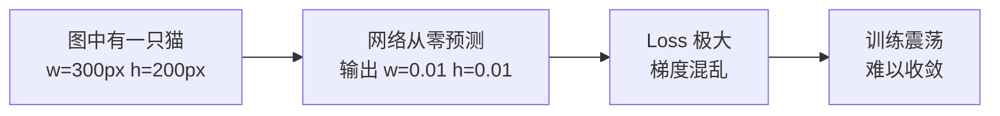
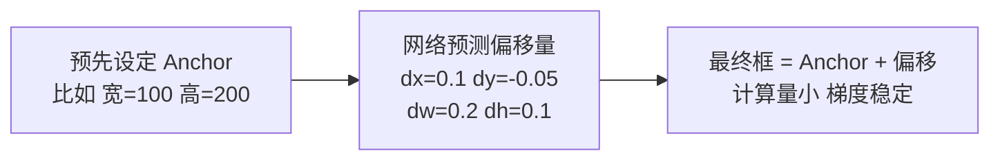
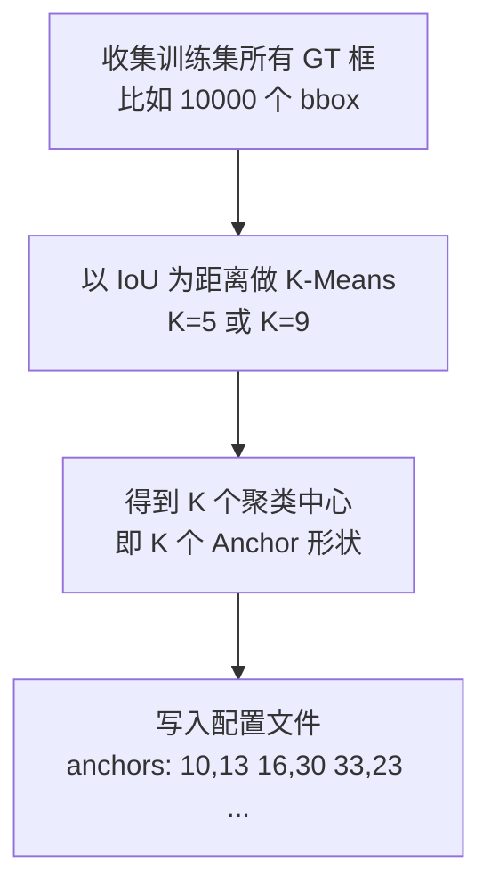
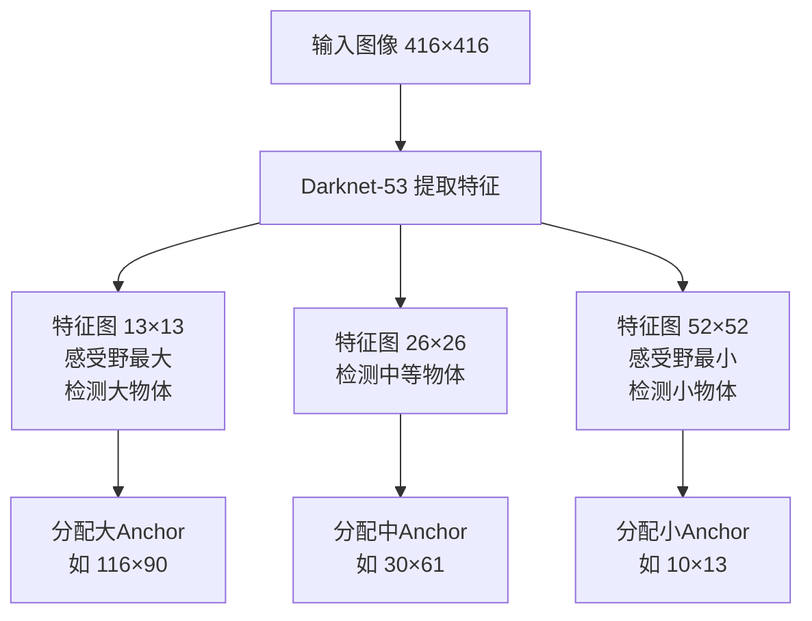
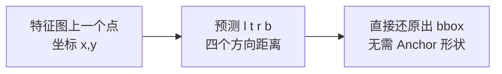

# Anchor Box 机制

> **一句话**：Anchor Box 是模型在预测之前就"预设"的一批候选框形状，让网络只需要预测**偏移量**而不是从零猜坐标。

上级笔记：[[YOLO学习路线图]]

---

## 为什么需要 Anchor Box？先理解问题

### YOLOv1 的做法（没有 Anchor）

YOLOv1 把图像划分成 S×S 个 Grid Cell，每个格子直接预测 2 个边界框的 4 个坐标值：

$$\text{预测输出} = (x, y, w, h, \text{confidence})$$

> [!WARNING] YOLOv1 的致命问题
> 直接回归 `w` 和 `h` 的绝对值极不稳定——网络一开始对"一个框应该多大"毫无概念，损失函数的梯度信号极弱，大物体和小物体的 Loss 量级差异巨大，导致训练不稳定、小目标检测极差。

### 问题的本质



---

## Anchor Box 的解决方案（YOLOv2，2017）

### 核心思想

不让网络"从零猜"，而是**预先定义一批具有代表性形状的候选框**（称为 Anchor），网络只需要预测相对于 Anchor 的**偏移量**。



> [!TIP] 关键直觉
> 就像考试填空题。没有 Anchor = 空白格子里写一篇作文；有 Anchor = 已经印好了大概答案，你只需要微调几个字。

### 偏移量的数学公式

设 Anchor 的宽高为 $(p_w, p_h)$，中心为格子左上角 $(c_x, c_y)$，网络预测 $(t_x, t_y, t_w, t_h)$，则最终框为：

$$b_x = \sigma(t_x) + c_x$$

$$b_y = \sigma(t_y) + c_y$$

$$b_w = p_w \cdot e^{t_w}$$

$$b_h = p_h \cdot e^{t_h}$$

> [!NOTE] 为什么用 sigmoid 和 exp？
> - $\sigma(t_x)$：把偏移约束在 0~1 之间，确保预测中心不会跑出当前格子
> - $e^{t_w}$：宽高必须为正数，指数函数天然保证这一点，且对小偏移敏感

---

## Anchor 形状从哪里来？K-Means 聚类

YOLOv2 的创新之一：不是手工设计 Anchor，而是**对训练集所有标注框做 K-Means 聚类**，自动找出最常出现的 K 种形状。



> [!EXAMPLE] YOLOv3 的 9 个 Anchor（COCO 数据集）
> ```
> 小尺度特征图（检测大物体）：(116,90)  (156,198)  (373,326)
> 中尺度特征图（检测中物体）：(30,61)   (62,45)    (59,119)
> 大尺度特征图（检测小物体）：(10,13)   (16,30)    (33,23)
> ```
> 每个数字是 `(宽, 高)`，单位是像素（基于 416×416 输入）

---

## YOLOv3 如何使用 Anchor：多尺度检测

这是 v3 相对于 v2 最重要的进步——用 3 个不同分辨率的特征图，每个特征图分配 3 个 Anchor，共 9 个。



> [!INFO] 为什么大特征图检测小物体？
> 52×52 的特征图每个格子只覆盖原图 8×8 像素（416/52=8），空间分辨率高，能"看到"小物体的细节。13×13 的特征图每格覆盖 32×32 像素，感受野大，适合定位大物体。

与 [[多尺度特征金字塔 FPN]] 的关系：v3 是 FPN 思想的直接应用。

---

## YOLOv8 为什么抛弃了 Anchor？

### Anchor 的问题

> [!WARNING] Anchor-based 的三大痛点
> 1. **需要手工调 Anchor**：换数据集必须重新 K-Means，超参数增加
> 2. **正负样本不平衡**：大量 Anchor 与 GT 不匹配（负样本），训练效率低
> 3. **预测冗余**：每个位置预测 K 个框，大量重叠，NMS 压力大

### YOLOv8 的 Anchor-free 方案

不再预设形状，直接预测每个点到边界框四条边的**距离**：

$$\text{预测} = (l, t, r, b) \quad \text{即左/上/右/下的距离}$$

$$\text{最终框} = (x - l,\ y - t,\ x + r,\ y + b)$$



相关笔记：[[Anchor-free 检测头]]

---

## 版本演进总结

| 版本 | Anchor 策略 | 关键改进 |
|------|------------|---------|
| YOLOv1 | 无 Anchor，直接回归 | 速度快，但精度差 |
| YOLOv2 | 5 个 Anchor，K-Means | 训练稳定，精度大幅提升 |
| YOLOv3 | 9 个 Anchor，3 尺度 | 支持小目标，多类别 |
| YOLOv4/v5 | 继承 v3，优化 Anchor 匹配策略 | 速度与精度进一步平衡 |
| YOLOv8 | 完全 Anchor-free | 更少超参数，更高 mAP |

---

## 关联笔记

- [[YOLO学习路线图]] — 回到总览
- [[损失函数 YOLO Loss]] — Anchor 如何参与 Loss 计算（IoU Loss）
- [[多尺度特征金字塔 FPN]] — 多尺度检测的特征提取原理
- [[Anchor-free 检测头]] — YOLOv8 的具体实现
- [[卷积神经网络基础]] — 理解感受野为什么影响 Anchor 分配

---

*下一步建议*：[[损失函数 YOLO Loss]] — 看 Anchor 如何具体参与训练
