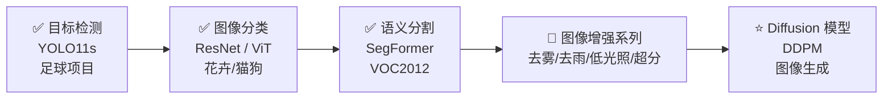
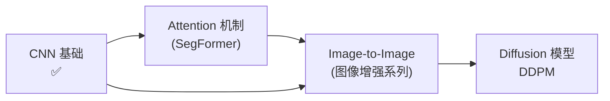

# CV 学习总路线图

> 导师任务驱动，目标是覆盖主要 CV 课题，最终走向 Diffusion 模型。

上级笔记：无（本笔记是知识图谱新的根节点）

---

## 整体进度

---

## 各阶段详细说明

### ✅ 阶段一：目标检测（已完成）

- **项目**：足球场景 player / referee / ball 三类检测
- **模型**：YOLO11s（Ultralytics 框架）
- **实验**：exp1 基线 → exp2 copy_paste → exp3 imgsz=1280+MPS（见 [[exp1-诊断与exp2计划]]）
- **核心收获**：训练曲线解读、mAP/Precision/Recall、损失函数三分量、混淆矩阵
- **关键教训**：三次实验 mAP50-95 均卡在 ~0.58，瓶颈是验证集太小（33 张图、28 个球），不是模型问题。数据增强解决不了分辨率不足的问题。
- **笔记**：[[YOLOv11-目标检测入门]] · [[损失函数 YOLO Loss]] · [[Anchor Box 机制]] · [[卷积神经网络基础]]

---

### ✅ 阶段二：图像分类（已完成）

- **模型**：ResNet、ViT
- **任务**：花卉/猫狗识别类简单分类
- **核心收获**：PyTorch 训练循环，分类 loss（CrossEntropy），CNN vs Transformer 对比

---

### 🔄 阶段三：语义分割（进行中）

- **模型**：SegFormer-B0（导师指定复现）
- **数据集**：VOC2012（21类含背景，1464 train / 1449 val，~2GB）
- **与目标检测的区别**：检测输出"框"，分割输出"每个像素的类别"
- **评价指标**：mIoU（而非 mAP）
- **笔记**：[[SegFormer-语义分割入门]] · [[seg-exp1-计划]]

> [!TIP] 为什么先做语义分割
> 和目标检测同属"场景理解"，但粒度更细。SegFormer 用 Transformer 做编码器，是从 CNN 过渡到 Transformer 架构的好桥梁，也是理解后续 Diffusion 中注意力机制的基础。

---

### 🔄 阶段四：图像增强系列

以下四个课题任选顺序，每个做一个代表性模型：

| 课题 | 代表模型 | 核心问题 | 状态 |
|------|---------|---------|------|
| 超分辨率重建 | SRCNN | 低分辨率 → 高分辨率 | ✅ PSNR 26.32 dB |
| 图像去雾 | AOD-Net | 有雾图像 → 清晰图像 | ✅ exp2 最佳 PSNR 24.46 dB |
| 图像去雨 | MPRNet | 雨纹去除 | 🔄 概念笔记完成，实验待做 |
| 低光照增强 | Zero-DCE | 暗图 → 正常曝光 | 🔄 exp1 失败（退化解），exp2 进行中 |

这四个本质相同：**输入退化图像，输出干净图像**，都是图像到图像（Image-to-Image）的任务，正好是 Diffusion 的基础。

- **笔记**：[[SRCNN-超分辨率入门]] · [[srcnn-exp1-结果]] · [[AODNet-图像去雾入门]] · [[MPRNet-图像去雨入门]] · [[ZeroDCE-低光照增强入门]]

---

### ⭐ 阶段五：Diffusion 模型（终极目标）

- **模型**：DDPM（Denoising Diffusion Probabilistic Models）
- **为什么放最后**：Diffusion 需要理解：
  - 卷积网络（阶段一/二已有）
  - 注意力机制 Attention（SegFormer 会用到）
  - 图像到图像的映射思路（阶段四会用到）
  - 概率/噪声调度（新知识）
- **笔记**：[[DDPM-扩散模型入门]] ✅ · [[StableDiffusion-VAE与CrossAttention]] 🔄（VAE / Cross-Attention / Multi-Head Attention）· [[Stable-Diffusion-LoRA入门]] ✅

---

## PyTorch 技能进度

| 技能 | 状态 |
|------|------|
| 使用现成框架训练（Ultralytics）| ✅ |
| 自己写训练循环 | ✅（ResNet/ViT 已做过）|
| 自定义数据集 DataLoader | ✅（VOC2012 + SR 动态生成对）|
| 自定义 Loss 函数 | ✅（CrossEntropy + MSE 均已用）|
| 模型保存与加载 | ✅（torch.save / load_state_dict）|
| 混合精度训练（AMP）| 🔲 |

---

## 关联笔记

- [[YOLO学习路线图]] — 目标检测子图谱
- [[卷积神经网络基础]]
- [[损失函数 YOLO Loss]]
- [[Anchor Box 机制]]
