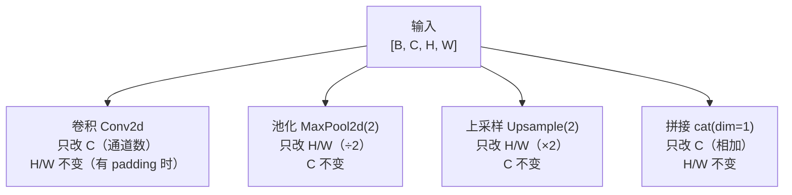
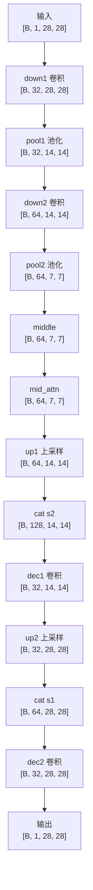

# Tensor Shape 追踪指南

上级笔记：[[CV学习总路线图]]
相关笔记：[[DDPM-扩散模型入门]] · [[UNet-图像去模糊入门]]

---

## 为什么要追踪 Shape

跑通代码不等于理解代码。能独立追踪 shape 变化，意味着拿到任何新模型都能回答：
- 这一层在压缩还是扩张信息？
- 这里为什么通道数翻倍？
- 两个特征图为什么能相加/拼接？

这是读懂 Transformer、ControlNet、DiT 等任意新架构的通用基本功。

---

## 四个维度的含义

```
[B,  C,   H,   W]
 ↑   ↑    ↑    ↑
批量 通道  高   宽
```

想象一叠照片：
- **B**（batch size）：这一叠里有多少张照片
- **C**（channels）：每张照片有几层（灰度=1，彩色=3，经过卷积后=特征层数）
- **H / W**：每张照片的像素高度和宽度

| 示例 | 含义 |
|------|------|
| `[64, 1, 28, 28]` | 64张灰度图，28×28像素 |
| `[16, 3, 640, 640]` | 16张彩色图，640×640像素（YOLO输入）|
| `[8, 64, 128, 128]` | 8张图，经过卷积后有64个特征层 |

> 卷积之后的 C 不再是"颜色层"，而是**特征图（feature map）**——每层代表网络学到的一种观察角度（边缘、纹理、形状等）。

---

## 四种基本操作对 Shape 的影响



| 操作 | 改变 | 不变 |
|------|------|------|
| 卷积 Conv2d | C（通道数） | H、W |
| 池化 MaxPool2d(2) | H、W（÷2） | C |
| 上采样 Upsample(2) | H、W（×2） | C |
| 拼接 cat(dim=1) | C（两者相加） | H、W |

---

## 读代码的方法

只需要看 `__init__` 里定义层的部分，找每一层的 `in_channels` 和 `out_channels`：

```python
# ResBlock(in_ch, out_ch, ...) → 输入通道 in_ch，输出通道 out_ch
self.down1 = ResBlock(1,   32, ...)   # 1→32
self.down2 = ResBlock(32,  64, ...)   # 32→64
self.dec1  = ResBlock(128, 32, ...)   # 128→32
```

`out_channels` 是我们人为设定的超参数，决定这一层提取多少种特征。

---

## 完整示例：DDPM UNet（28×28 灰度图）



**为什么输出是 1 通道？** 因为 UNet 预测的是噪声，噪声和输入图片形状完全一致。

---

## UNet 结构本质

```
编码器（左边）：反复 卷积提特征 + 池化缩尺寸，感受野越来越大
      ↓
瓶颈（middle）：尺寸最小时做全局 Attention，让所有位置互相交流
      ↓
解码器（右边）：反复 上采样扩尺寸 + cat补细节 + 卷积融合
```

**Skip Connection（跳跃连接）** 的作用：编码器每次下采样前存一份特征，解码器上采样后通过 cat 拼接进来，补充压缩过程中丢失的细节。

---

## 追踪任意新模型的步骤

1. 找输入 shape（DataLoader 输出什么）
2. 看 `__init__` 里每一层的 `in_channels / out_channels`
3. 池化 → H/W 减半；上采样 → H/W 翻倍；cat → C 相加
4. 输出 shape 和 target 对齐，确认 loss 能计算
