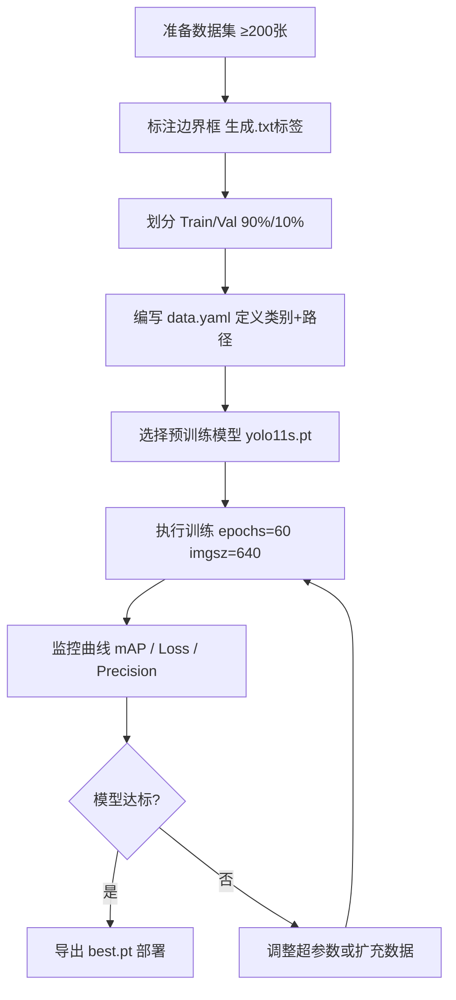
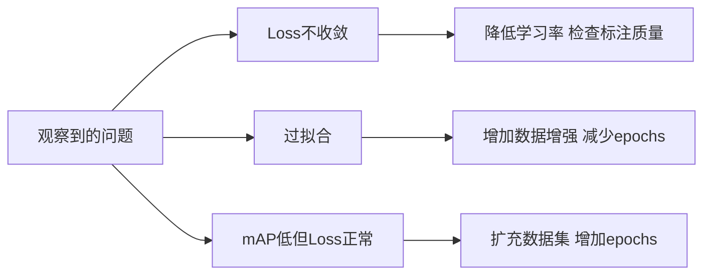
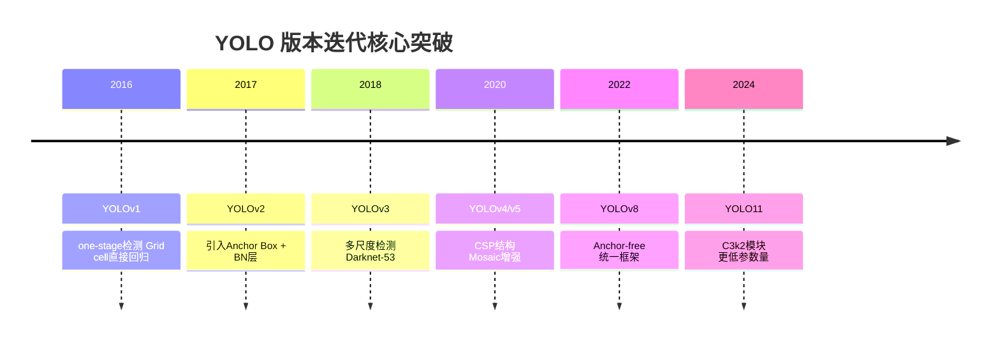
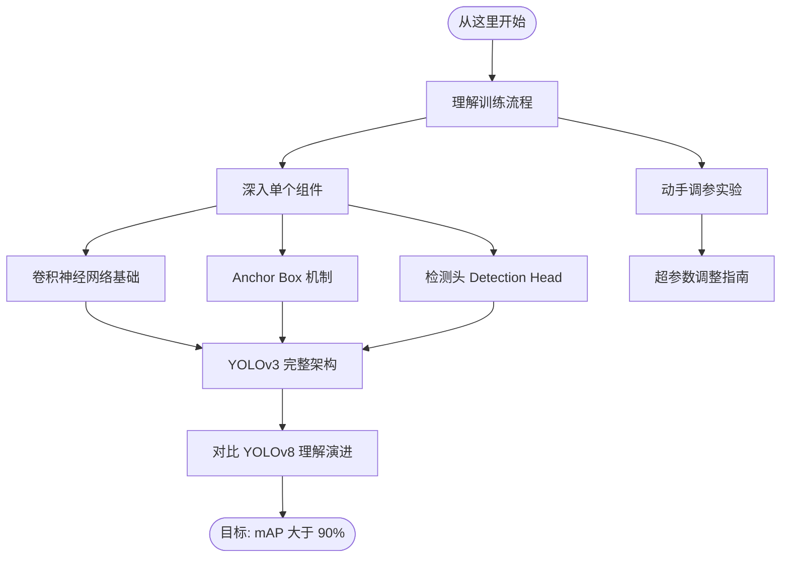

# YOLO 学习路线图

> 从最有趣的项目出发，向下挖掘每一个基础概念。
> 这是整个知识图谱的 **根节点**。

---

## 为什么从 YOLO 开始？

YOLO（You Only Look Once）是目标检测领域最经典的工程实践：
- **一次前向传播**就能输出所有目标的位置和类别
- 从 v1（2016）到 v11（2024），每一次迭代都踩在一个核心问题上
- Ultralytics 的训练框架把复杂的训练流程包成了几行命令，**适合从实践反推原理**

---

## 一次完整的 YOLO 训练流程（来自 Colab 项目）

---

## 三个必须理解的核心问题

### 1. 怎么判断模型训练好了？

| 指标 | 含义 | 目标 |
|------|------|------|
| **mAP@0.5** | IoU>0.5 时的平均精度 | >80% 合格，>90% 优秀 |
| **Precision** | 预测为正中真正是正的比例 | 越高误报越少 |
| **Recall** | 所有真实目标中被检测到的比例 | 越高漏报越少 |
| **Train Loss** | 训练集误差 | 应持续下降并收敛 |
| **Val Loss** | 验证集误差 | 应与 Train Loss 同步，否则过拟合 |

> **关键信号**：Val Loss 开始上升而 Train Loss 还在降 → [[过拟合与正则化]] 发生了

### 2. 超参数调整的逻辑是什么？

详细调参逻辑见 [[超参数调整指南]]

### 3. YOLO 各版本更新了什么？

每个版本背后的技术细节：
- [[Anchor Box 机制]] — v2 引入，v8 彻底抛弃，这是理解 YOLO 演进的主线
- [[多尺度特征金字塔 FPN]] — v3 开始支持小目标检测
- [[Mosaic 数据增强]] — v4/v5 引入，大幅提升小目标检测
- [[Anchor-free 检测头]] — v8 的核心改变

---

## 学习路径建议

对应笔记链接：
- [[卷积神经网络基础]] — stride, padding, receptive field
- [[Anchor Box 机制]] — 为什么需要它，v8 为什么去掉它
- [[损失函数 YOLO Loss]] — 分类损失 + 定位损失 + 置信度损失
- [[超参数调整指南]] — 学习率、batch size、epochs 的系统调法
- [[过拟合与正则化]] — Dropout、数据增强、早停

---

*下一步*：[[Anchor Box 机制]]
