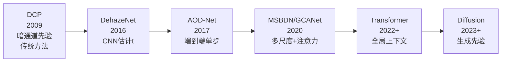

# AOD-Net：图像去雾入门

上级笔记：[[CV学习总路线图]]
相关笔记：[[SRCNN-超分辨率入门]]

---

## 历史发展背景

去雾研究比深度学习早了十多年，经历了从"利用物理先验"到"端到端学习"的范式转变。

### 传统方法（2009–2015）

**Dark Channel Prior（DCP，He et al., CVPR 2009）** 是最重要的传统方法，获 CVPR 2009 最佳论文：
- 核心观察：自然无雾图像中，每个局部区域至少有一个颜色通道的像素值接近零（"暗通道"）
- 利用这一先验直接估计透射率 t，再代入大气散射公式还原清晰图
- 问题：在天空区域（没有"暗"的颜色通道）失效，且运行速度慢

```
DCP 局限：
- 天空/白色物体区域：先验假设不成立
- 依赖固定大小的局部 patch（无法自适应）
- 无法利用数据学习，泛化到复杂真实场景困难
```

### 深度学习早期（2016–2017）

| 年份 | 模型 | 思路 |
|------|------|------|
| 2016 | DehazeNet（Cai et al.）| 第一个 CNN 去雾方法，CNN 估计透射率 t，再代入物理公式 |
| 2017 | MSCNN（Ren et al.）| 多尺度 CNN 估计 t，更准确但仍是两步走 |
| 2017 | AOD-Net（Li et al.）| **合并两步为一步**，直接输出改写物理公式的中间变量 K |

AOD-Net 的贡献：把"估计 t + 代入公式"两步合并成一次前向传播，简化流程、减少误差累积。

---

## 什么是图像去雾

雾天拍摄的图像颜色偏白、细节模糊、对比度低，去雾的目标是还原出清晰图像。

```
有雾输入 (Hazy)  →  AOD-Net  →  去雾输出 (Dehazed)  ≈  清晰原图 (Clean)
```

与超分辨率的对比：

| | SRCNN（超分）| AOD-Net（去雾）|
|--|--|--|
| 退化原因 | 分辨率不足（信息丢失）| 雾/霾遮挡（信息叠加）|
| 退化可逆性 | 部分不可逆 | 理论上可完全还原 |
| 物理模型 | 无（纯数据驱动）| **有**（大气散射方程）|
| 数据构造 | 缩小再放大 | 用公式合成有雾图 |

---

## 核心原理：大气散射模型

雾霾图像的形成由一个物理公式精确描述：

```
I(x) = J(x) · t(x) + A · (1 - t(x))
```

| 符号 | 名称 | 含义 |
|------|------|------|
| `I(x)` | 有雾图 | 相机实际拍到的（模型输入）|
| `J(x)` | 清晰图 | 没有雾时应该看到的（目标输出）|
| `t(x)` | 透射率 | 光线穿透雾到达相机的比例（0~1）|
| `A` | 大气光 | 雾本身的亮度（接近白色，通常取 1.0）|

**直觉理解**：

```
t = 1.0  →  I = J          （无雾，完全透明）
t = 0.5  →  I = 0.5·J + 0.5·A  （半雾，图像和雾各占一半）
t = 0.0  →  I = A          （全雾，什么都看不见，只剩白色）
```

**合成有雾图（正向）**：已知 J，随机取 t ∈ [0.3, 0.8]，代入公式得到 I。

**去雾（反向）**：已知 I，希望恢复 J：

```
J(x) = (I(x) - A) / t(x) + A
```

问题是 t(x) 是未知的——这正是神经网络要学习的。

---

## 数据集：合成雾（VOC2012）

去雾任务不需要下载新数据集，直接用 VOC2012 的清晰图片合成有雾版本：

```python
def synthesize_haze(img_tensor, t=None, A=1.0):
    if t is None:
        t = random.uniform(0.3, 0.8)   # 随机透射率
    hazy = img_tensor * t + A * (1 - t)
    return hazy.clamp(0, 1), t
```

每次取出一张图时：
1. 读取清晰图 J
2. 随机采样透射率 t
3. 用公式计算 I（有雾图）
4. 把 (I, J) 送给模型训练

这样每个 epoch 每张图看到的雾的浓度都不同，起到了数据增强的效果。

**与 SRCNN 数据构造的对比**：

| | SRCNN | AOD-Net |
|--|--|--|
| 退化方式 | 双三次下采样 | 大气散射公式 |
| 随机性 | 随机裁剪位置 | 随机透射率 t |
| 物理依据 | 无 | 有（光学物理）|

---

## AOD-Net 架构（Li et al., 2017）

**exp2 参数量：10,539**（每层通道数从 3 扩展到 8，见 [[aodnet-exp1-诊断与exp2计划]]）

### 设计思路

传统方法分两步：先估计 t(x)，再代入物理公式求 J。
AOD-Net 把两步合并成一步——网络直接输出一个中间变量 K，然后用改写后的物理公式一步得到清晰图。

**公式推导**：

原始去雾公式（A=1 时）：
```
J = (I - 1) / t + 1
```

AOD-Net 不预测 t，而是预测 K = t（等价替换），最终公式：
```
J = (I - 1) / K + 1
```

网络只需要学会预测 K，物理约束自动保证输出合理。

### 网络结构

```
输入有雾图 I  (3, H, W)
    │
    ├─ conv1(1×1) → x1   提取紧凑特征
    │
    ├─ conv2(3×3) → x2   局部纹理
    │
    ├─ conv3(5×5) ← [x1, x2]  中尺度特征
    │
    ├─ conv4(7×7) ← [x2, x3]  大感受野特征
    │
    └─ conv5(3×3) ← [x3, x4]  → K  融合输出透射率估计
            │
            ▼
    J = (I - 1) / K + 1    物理公式还原清晰图
            │
            ▼
    输出清晰图 J  (3, H, W)
```

每层的 `[x_i, x_j]` 表示 **拼接（concatenate）**，把两个特征图沿通道维度合并。
这是一种轻量的多尺度特征融合方式，用不同大小的卷积核捕获不同范围的雾分布。

### 各层参数量

| 层 | 卷积核 | 输入通道 | 输出通道 | 参数量 |
|----|--------|---------|---------|--------|
| conv1 | 1×1 | 3 | 3 | 12 |
| conv2 | 3×3 | 3 | 3 | 84 |
| conv3 | 5×5 | 6 | 3 | 453 |
| conv4 | 7×7 | 6 | 3 | 885 |
| conv5 | 3×3 | 6 | 3 | 327 |
| **合计** | | | | **1,761** |

---

## 损失函数与评价指标

和 SRCNN 完全一致：

```python
criterion = nn.MSELoss()          # 预测清晰图 vs 真实清晰图
```

评价指标同样是 **PSNR**。

但去雾的 PSNR 通常比超分更高，因为：
- 有雾图的退化是线性叠加（可逆），信息没有丢失
- 超分是下采样（非线性，细节永久丢失）

预期结果：30 epoch 后 val PSNR > 30 dB。

---

## 训练配置

| 参数 | 值 |
|------|-----|
| model | AOD-Net（1,761 参数）|
| 数据集 | VOC2012，合成随机雾 t∈[0.3,0.8] |
| patch_size | 256×256（比 SRCNN 大，因为模型更小）|
| epochs | 30 |
| batch_size | 16 |
| lr | 1e-4，Adam |
| device | mps |

---

## 三个项目横向对比

| | YOLO（检测）| SegFormer（分割）| SRCNN（超分）| AOD-Net（去雾）|
|--|--|--|--|--|
| 任务类型 | 分类+回归 | 像素分类 | 像素回归 | 像素回归 |
| 数据标注 | 人工 bbox | 人工 mask | 自动生成 | **物理公式生成** |
| Loss | 三分量 | CrossEntropy | MSE | MSE |
| 指标 | mAP | mIoU | PSNR | PSNR |
| 参数量 | 9.4M | 3.7M | 20K | **1,761** |
| 物理模型 | 无 | 无 | 无 | **有** |

→ 实验日志见 [[aodnet-exp1-诊断与exp2计划]]

---

## 研究前沿与最新进展

### 技术演进时间线



### Transformer 时代（2022–2024）

CNN 方法的局限：卷积感受野有限，难以建模雾浓度随深度变化的全局规律。Transformer 的全局注意力机制天然适合这个问题。

代表性工作：
- **DehazeFormer**（2022）：用 Swin Transformer 替换 CNN 主干，全局上下文显著改善天空区域的去雾效果
- **MB-TaylorFormer**（ICCV 2023）：多分支 Transformer，对非均匀雾（局部浓度不同）效果更好

### 真实世界去雾的挑战

学术方法（包括 AOD-Net）都在**合成有雾图**上训练，而真实世界的雾：
1. 不完全符合大气散射模型（有灰尘、烟雾等混合退化）
2. 深度图 t(x) 不是简单的均匀梯度
3. A 也不是固定值

这导致合成数据训练的模型在真实场景泛化能力有限——这是去雾领域仍未完全解决的核心问题。

### 扩散模型的介入（2023+）

Diffusion 方法通过学习 p(clean | hazy) 的条件分布，可以生成更真实的去雾结果，而不是"均值估计"。
在真实无配对数据场景下，也可以用无监督 Diffusion 方法。

→ 原理见 [[DDPM-扩散模型入门]]
