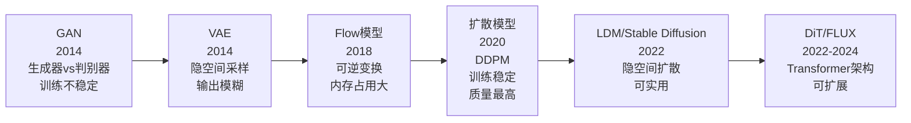
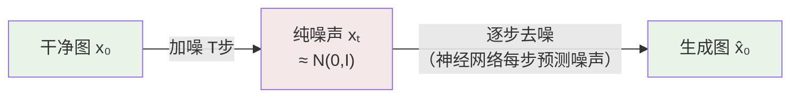
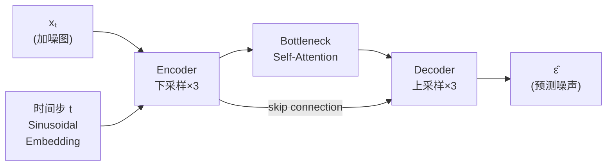
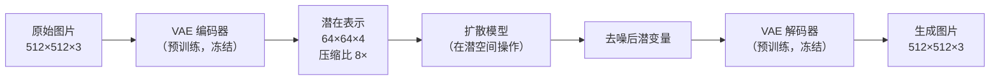
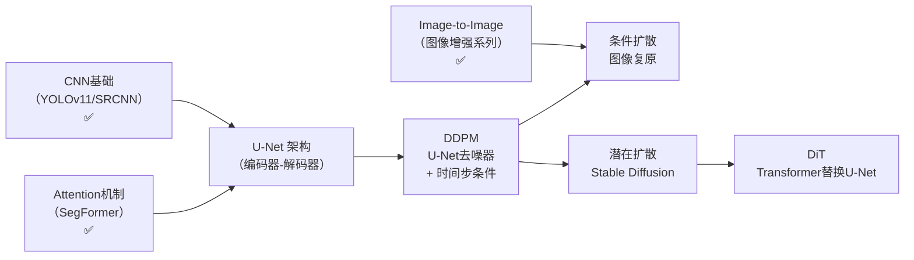
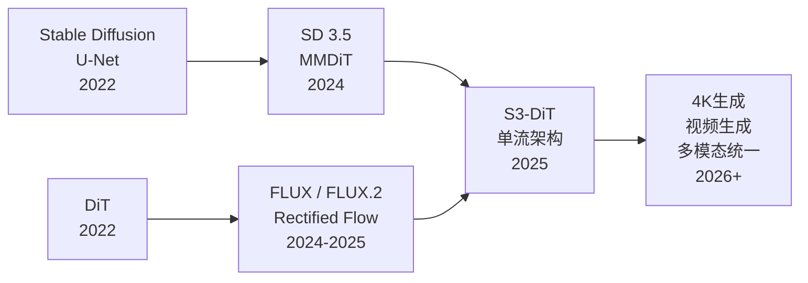

# DDPM：扩散模型入门

上级笔记：[[CV学习总路线图]]
相关笔记：[[SRCNN-超分辨率入门]] · [[ZeroDCE-低光照增强入门]] · [[MPRNet-图像去雨入门]]

---

## 为什么需要扩散模型

在学完 CNN 和 Transformer 之后，你已经能做：
- 图像分类（ResNet / ViT）
- 语义分割（SegFormer）
- 图像复原（SRCNN / AOD-Net / Zero-DCE / MPRNet）

这些都是 **判别式模型**（Discriminative Model）：给定输入 X，预测输出 Y。

但有一类问题它们无法解决：
```
"给我画一张从未存在过的猫的图片"
"把这张粗糙的低分辨率图变成一张有丰富细节的高清图"
```

这些需要**生成式模型**（Generative Model）：学习数据的概率分布，从中**采样**出新数据。

---

## 生成模型的发展脉络



**GAN 的问题**：生成器和判别器博弈，训练不稳定（模式崩溃/梯度消失），需要精细调参。

**扩散模型的优势**：训练目标明确（预测噪声），稳定收敛，2020 年后在图像质量上全面超越 GAN。

---

## 核心直觉：学习逆转加噪过程

扩散模型的思想极其简单，分两个过程：

### 前向过程（加噪）：已知，固定的，不需要训练

```
干净图片 x₀  →  加一点噪声 x₁  →  加更多噪声 x₂  →  ...  →  纯高斯噪声 xₜ
```

经过 T 步（通常 T=1000），任何图片都变成无法辨认的高斯噪声。

每步加的噪声量由**噪声调度（Noise Schedule）β_t** 控制，是预先设定好的，不需要学习。

### 逆向过程（去噪）：需要学习的

```
纯高斯噪声 xₜ  →  稍微干净一点 xₜ₋₁  →  ...  →  干净图片 x₀
```

神经网络学的事情只有一件：**给定加了 t 步噪声的图 xₜ，预测其中加的噪声 ε**。

学会预测噪声，就等于学会了一步步去噪。这就是生成的过程。



---

## 训练目标：比想象的简单

DDPM 的训练算法（Ho et al., NeurIPS 2020）：

```
1. 从训练集取一张干净图 x₀
2. 随机采样时间步 t ∈ {1, ..., T}
3. 采样一个高斯噪声 ε ~ N(0, I)
4. 把 ε 加到 x₀，得到 xₜ（有个闭式公式，不需要 t 步循环）
5. 用神经网络预测 ε̂ = network(xₜ, t)
6. Loss = ||ε - ε̂||²（预测的噪声 vs 真实噪声的 MSE）
```

注意几件事：
- Loss 是 **MSE**——和 SRCNN 一样，只是预测目标变成了"噪声"而不是"干净图"
- 训练时不需要逐步去噪，有公式直接把干净图一步变成 t 步后的噪声图
- **神经网络的输入**：加噪图 xₜ 和时间步 t（告诉网络当前噪声有多严重）

### 关键公式（直觉版）

加噪过程有一个好性质：**可以一步跳跃到任意 t**：

```
xₜ = √(ᾱₜ) · x₀ + √(1 - ᾱₜ) · ε

其中 ᾱₜ 是累积噪声系数（t 越大，ᾱₜ 越小，图越接近纯噪声）
```

不需要一步步循环加噪，这让训练非常高效。

---

## 神经网络结构：U-Net 作为去噪器

DDPM 的网络结构是带 **时间步编码** 的 **U-Net**：



关键设计：
- **时间步编码**：用 Sinusoidal 位置编码把时间步 t 编码成向量，注入每一层，让网络知道"现在噪声有多严重"
- **Self-Attention**：在 U-Net 的 Bottleneck 层加入注意力机制，建模全局结构
- **Skip Connection**：和 U-Net 分割模型一模一样，传递空间信息

这里的 U-Net 和 SegFormer 里的 Encoder-Decoder 思想是一脉相承的——只是任务从"预测类别"变成了"预测噪声"。

---

## 采样：从噪声生成图片

训练完成后，生成新图片的步骤：

```python
# 从纯高斯噪声开始
x = randn(image_shape)

# 逐步去噪（T 步，通常 T=1000）
for t in range(T, 0, -1):
    # 网络预测当前的噪声
    noise_pred = model(x, t)
    # 减去预测的噪声，得到稍微干净的图
    x = denoise_step(x, noise_pred, t)

# 最终 x 就是生成的图片
```

**问题**：1000 步采样非常慢（~20 秒/张在 GPU 上）。

---

## DDIM：10-50 步采样（2020）

**DDIM**（Song et al., ICLR 2021）发现：DDPM 的每一步加噪是随机的（Markov Chain），但去噪不一定必须是随机的。

DDIM 改写了去噪公式，使得整个过程变成**确定性的（Deterministic）**：
- 相同的初始噪声 → 相同的生成结果（可复现）
- 可以**跳步**：不是每步都去噪，而是直接从 t=1000 跳到 t=800、600、400...
- 只需 20-50 步，质量几乎不变

```
DDPM：1000 步，随机，~20s/张
DDIM：20-50 步，确定性，~1-2s/张
```

DDIM 使扩散模型从"理论可行"变成了"工程可用"。

---

## 条件生成：让扩散模型"听话"

无条件 DDPM 生成的是随机图片，无法控制内容。条件生成让你控制：

### 方法：Classifier-Free Guidance（CFG，2021）

训练时：随机把条件（文字/类别）置为空，让模型同时学有条件和无条件生成。

采样时：

```python
# 有条件预测（"一只猫"）
noise_cond = model(x, t, condition="一只猫")

# 无条件预测
noise_uncond = model(x, t, condition=None)

# 加权组合——guidance scale w 越大，越"听"条件
noise = noise_uncond + w × (noise_cond - noise_uncond)
```

**guidance scale w**（通常 7-15）：w 越大，生成的图片越符合条件，但多样性降低。这是最关键的采样超参数。

---

## 潜在扩散模型（LDM）：Stable Diffusion 的核心（2022）

在像素空间做扩散模型有个问题：一张 512×512 的 RGB 图有 786,432 个像素，1000 步采样代价极高。

**Latent Diffusion Model（LDM，Rombach et al., CVPR 2022）** 的解决方案：



关键思路：
1. **用 VAE 把图片压缩到潜空间**（64×64×4，信息密度高）
2. **扩散过程在潜空间进行**（计算量减少 48 倍）
3. **生成后 VAE 解码回像素空间**

Stable Diffusion 就是 LDM 的开源实现，2022 年由 Stability AI 发布，彻底改变了 AI 图像生成领域。

### 文字控制：CLIP 文本编码器

Stable Diffusion 的文字条件来自 **CLIP**（Contrastive Language-Image Pre-training）：
- CLIP 将文字编码成与图像特征对齐的向量
- 这个向量通过 **Cross-Attention** 注入 U-Net 的每一层
- 模型学会了"让生成的图与文字描述对应"

```
"a cat wearing a hat"
        ↓ CLIP Text Encoder
     文本向量 (77×768)
        ↓ Cross-Attention
  U-Net 各层接收文字引导
        ↓
   符合描述的图片
```

---

## DiT：用 Transformer 替换 U-Net（2022）

**DiT**（Diffusion Transformer，Peebles & Xie, 2022）：

DDPM/LDM 用 U-Net 作去噪网络。DiT 的问题：**为什么不用 Transformer？**

DiT 把图片分成 patch（和 ViT 一样），用纯 Transformer 块处理，时间步和条件通过 AdaLayerNorm 注入。

**关键发现**：模型越大（参数越多），生成质量越高，且呈现可预测的 Scaling Law——这和 GPT 系列相同。

```
DiT-S（33M）→ DiT-B（130M）→ DiT-L（458M）→ DiT-XL（675M）
                                                  ↑
                                      FID 在 ImageNet 上达到 SOTA
```

DiT 的意义：证明了 Transformer 的"越大越好"规律也适用于图像生成，为 Sora 等视频生成模型奠定了架构基础。

### Sora（2024）：视频生成

OpenAI 的 Sora 是 DiT 思路在视频领域的应用：
- 把视频当成时空 patch 序列
- 用 DiT 处理，实现高质量视频生成

### FLUX（Black Forest Labs, 2024）

FLUX 是 Stable Diffusion 原班人马创立的 Black Forest Labs 发布的新模型：
- 基于 **Rectified Flow**（矫正流）而不是 DDPM 的随机过程，采样更高效
- 结合 DiT 架构（称为 MMDiT，多模态 DiT）
- 在文字渲染、构图精确性上超过 SDXL

---

## 扩散模型如何用于图像复原

你学过的所有图像复原课题，扩散模型都有对应的方案：

| 课题 | 传统方法 | 扩散模型方法 |
|------|---------|------------|
| 超分辨率 | SRCNN → ESRGAN | SR3, SeeSR, SupIR |
| 图像去雾 | AOD-Net | Diffusion dehazing |
| 低光照 | Zero-DCE | Diff-Retinex |
| 图像去雨 | MPRNet | DiffIR |

**扩散模型做图像复原的范式**：

```python
# 条件图像复原（以超分为例）
# x_LR：低分辨率图（条件）
# 目标：生成对应的高分辨率图

x = randn(HR_shape)  # 从噪声开始

for t in range(T, 0, -1):
    # 把 LR 图作为条件
    noise_pred = model(x, t, condition=x_LR)
    x = denoise_step(x, noise_pred, t)

# x 是生成的高清图——某一种"合理的"高频细节版本
```

**为什么扩散模型在图像复原上有优势**：
- 传统方法（MSE）：预测"所有可能输出的均值" → 模糊
- GAN：预测"某一种输出" → 有细节但不稳定
- 扩散模型：从概率分布中**采样**"某一种输出" → 细节丰富且稳定

---

## 核心概念速查表

| 概念 | 一句话解释 |
|------|-----------|
| 前向过程 | 固定的加噪过程，T 步把图片变成高斯噪声 |
| 逆向过程 | 学习的去噪过程，T 步从噪声还原图片 |
| 噪声预测 | 训练目标：预测加入的噪声 ε（不是预测干净图）|
| DDIM | 确定性去噪，20-50 步代替 1000 步 |
| CFG | Classifier-Free Guidance，用 guidance scale 控制条件强度 |
| Guidance Scale | 采样超参数，越大越符合条件，越小越随机多样 |
| LDM | 在 VAE 潜空间做扩散，计算量大幅减少 |
| Stable Diffusion | LDM 的开源实现 + CLIP 文本条件 |
| DiT | 用 Transformer 替换 U-Net 作去噪网络 |
| Rectified Flow | 更高效的扩散过程（直线 ODE 路径），FLUX 使用 |

---

## 连接你已经学过的知识



你已经具备了理解扩散模型所需的所有基础：
- **卷积 + U-Net**：DDPM 的去噪网络
- **Attention**：DDPM 的 Bottleneck 自注意力、Cross-Attention 文字条件
- **Image-to-Image**：条件扩散做图像复原的直觉基础

下一步：从零实现一个 DDPM（在 MNIST 或 CIFAR-10 上），理解前向加噪、逆向去噪的完整训练循环。

---

## 2025–2026 最新动向

### FLUX.2（Black Forest Labs，2025 年 11 月）

FLUX 系列的重大升级，2026 年初公认的综合最强开源图像生成模型：
- 生成器 **120 亿参数** + 文本编码器 47 亿参数
- 支持单次生成中输入最多 **10 张参考图**（角色一致性、品牌视觉）
- FLUX.1.1 Pro：4.5 秒/张，商业级写实效果

### Stable Diffusion 3.5（Stability AI，2024）

从 U-Net 完全切换到 **MMDiT（Multi-Modal Diffusion Transformer）**：
- 三重文本编码器：CLIP-G + CLIP-L + T5-XXL 联合理解文字
- 比 SD 1.x/2.x 的文字理解能力有质的飞跃

### Z-Image / S3-DiT（2025）

S3-DiT（Scalable Single-Stream DiT）：将文本和图像在**单一统一流**中处理，而不是双流架构（如 FLUX 的 MMDiT），速度更快、扩展性更强。

### 稀疏注意力与 4K 生成

2025 年 DiT 系列的主要工程优化方向：
- **稀疏注意力**：Token 数量随分辨率平方增长，4K 图像的注意力计算量极大——稀疏化后只关注重要位置
- 已有模型支持 4K 超高清图像直接生成

### 整体趋势（2026）



**U-Net 时代已经结束**——2026 年所有主流图像生成模型都基于 Transformer（DiT / MMDiT / S3-DiT），U-Net 退场。
