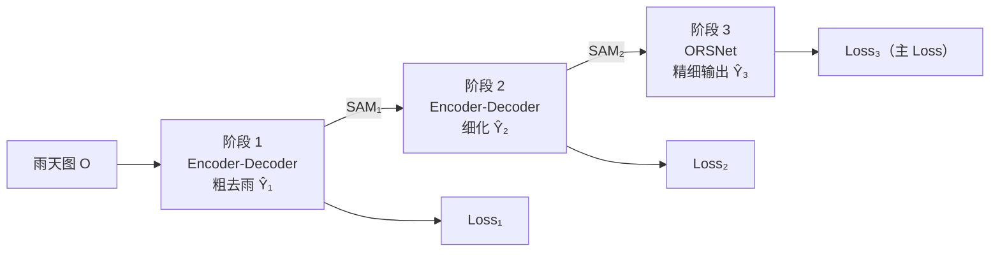
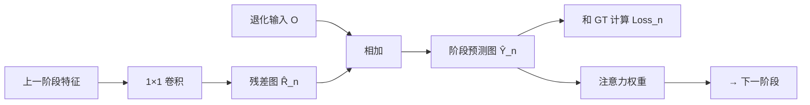
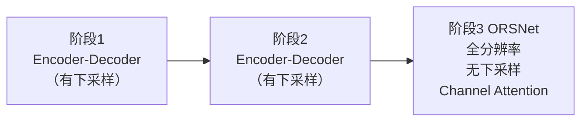

# MPRNet：图像去雨入门

上级笔记：[[CV学习总路线图]]
相关笔记：[[AODNet-图像去雾入门]] · [[ZeroDCE-低光照增强入门]] · [[SRCNN-超分辨率入门]]

---

## 历史发展背景

图像去雨从"手工设计滤波器"出发，经历了统计方法、CNN 到 Transformer 的演进。

### 传统方法（2009–2016）

- **基于滤波器**：用方向性高通滤波器提取雨纹，再减去——无法处理复杂背景中的雨纹
- **稀疏编码**（Luo et al., 2015）：建立雨纹字典，分离背景与雨纹——慢，且雨纹字典需手动设计

### 深度学习早期（2017–2020）

| 年份 | 模型 | 核心贡献 |
|------|------|---------|
| 2017 | DerainNet（Fu et al., TIP）| 第一个 CNN 去雨方法，在高频域（detail layer）操作 |
| 2017 | DDN（Fu et al., CVPR）| Dense Connection 增强特征复用，引入 Rain1400 数据集 |
| 2017 | JORDER（Yang et al., CVPR）| 联合检测+去除，能区分不同密度雨纹 |
| 2019 | PReNet（Ren et al., CVPR）| 渐进式循环网络，每次迭代细化输出，Rain100L PSNR 40.34 dB |

**为什么 CNN 方法有局限**：卷积感受野有限，对覆盖大面积的密集雨纹（Rain100H）效果差；多方向雨纹需要全局上下文。

### MPRNet：引入多阶段监督（2021）

单阶段方法一次性预测，很难同时兼顾全局（雨纹分布）和局部（雨纹精确边界）。MPRNet 用多阶段渐进细化解决这个问题。

---

## 与去雾的区别

| 特征 | 去雾（AOD-Net）| 去雨（MPRNet）|
|------|--------------|--------------|
| 退化形态 | 均匀弥漫（全局）| 条状雨纹（局部、有方向）|
| 退化模型 | 乘性 + 加性（大气散射）| **纯加性** |
| 空间分布 | 全图均匀 | 稀疏、结构化 |
| 主要难点 | 透射率估计 | 雨纹与图像纹理混淆 |

关键区别：雾是**空间均匀**的全局退化，雨纹是**局部稀疏、有方向性**的结构。对网络来说，去雨需要识别细长条纹并精准去除，比去雾在空间上更精细。

---

## 雨纹退化模型

```
O = B + R
```

| 符号 | 含义 |
|------|------|
| O（Observed）| 雨天图像（输入）|
| B（Background）| 干净背景图（目标输出）|
| R（Rain streak）| 雨纹层（加性稀疏信号）|

与去雾模型对比：
- 去雾：`O = B·t + A·(1-t)`（乘性，依赖深度图 t）
- 去雨：`O = B + R`（**纯加性**，结构更简单，理论上完全可逆）

---

## 残差学习：预测要去除的，而不是整张图

两种设计思路：

**思路 A：直接回归**
```
网络：O → B̂
Loss：||B̂ - B_GT||
```

**思路 B：残差学习（主流）**
```
网络：O → R̂（雨纹预测）
输出：B̂ = O - R̂
Loss：||B̂ - B_GT||
```

残差学习更常用的原因：
- 雨纹是稀疏信号——大部分像素是背景，只有少数像素是雨纹
- 预测"哪里有雨纹"比预测"整张图是什么"更容易学习
- 网络输出 R̂≈0 时就等于什么都没改，梯度有明确的优化方向

> [!NOTE] 和 Zero-DCE 的类比
> Zero-DCE 预测增强曲线参数（alpha），而不是直接预测目标图像。
> 去雨的残差学习异曲同工——两者都是预测"变化量"，让网络专注于差异部分。

---

## 数据集

### Rain100L / Rain100H（标准 benchmark）

| 数据集 | 训练对数 | 测试对数 | 特点 |
|--------|---------|---------|------|
| Rain100L | 200 | 100 | 轻雨，单方向雨纹 |
| Rain100H | 1800 | 100 | 重雨，多方向多密度雨纹叠加 |

来源：使用 BSD 数据集的干净图片，叠加人工合成的雨纹 pattern（不同角度、密度、宽度）。

> [!WARNING] Rain100H 数据污染问题
> Rain100H 原始训练集 1800 张中，有 **546 张与测试集共用相同背景图**。
> 部分论文会将这 546 张排除，只用剩余 1254 张训练，以避免数据泄漏影响评估公平性。

### 从 VOC2012 合成（本系列一贯方案）

程序化生成雨纹叠加到干净图：
```python
# 思路：生成倾斜方向的高斯噪声条纹
rain_layer = generate_rain_streaks(angle, density, length)
rainy = (clean + rain_layer).clamp(0, 1)
```
- 优点：与其他课题数据集统一，不需额外下载
- 缺点：合成雨纹比 Rain100L 更粗糙，与真实雨纹有差距

---

## MPRNet 架构（Zamir et al., CVPR 2021）

### 核心思想：三阶段渐进细化

一次性预测很难得到完美结果；不如把任务分成多个阶段，每阶段专注于细化上一阶段的输出：



三个阶段**各自独立受监督**——不只是最后一层有 Loss，每个阶段的输出都要和 GT 比较。这迫使中间阶段学到有意义的特征，而不是把所有压力堆给最后一层。

---

### 三个关键模块

#### ① SAM（Supervised Attention Module）——阶段间的信息传递



SAM 的作用：
1. 生成本阶段的预测图（并直接监督）
2. 生成注意力权重，告诉下一阶段"哪些区域还没去干净"
3. 引导下一阶段聚焦于残留的雨纹区域

#### ② CSFF（Cross-Stage Feature Fusion）——跨阶段特征复用

编码器各层的特征图通过**侧向连接**传给下一阶段的编码器，避免重复从头提取特征，稳定训练。类似 DenseNet 中的特征复用思想。

#### ③ ORSNet（Original Resolution Subnetwork）——第三阶段

前两个阶段使用 Encoder-Decoder：有下采样 → 有上采样 → **损失空间细节**。

第三阶段使用 ORSNet：**全程不降分辨率**，在原始分辨率上用 Channel Attention Block（CAB）精细处理，生成空间精确的最终输出。



---

## 超参数与调参方向

**MPRNet 论文原始去雨配置：**

| 参数 | 值 | 说明 |
|------|-----|------|
| n_feat | 40 | 基础特征通道数 |
| num_stages | 3 | 阶段数（也决定 Loss 分量数）|
| patch_size | 256 | 训练裁剪尺寸 |
| batch_size | 16 | |
| lr | 2e-4 → 1e-6 | cosine annealing 衰减 |
| optimizer | Adam | |
| iterations | 400,000 | 原论文配置 |

**调参方向：**

| 参数 | 调小影响 | 调大影响 |
|------|---------|---------|
| n_feat | 更快，精度下降 | 更慢，精度提升，可能过拟合 |
| num_stages | 退化为更简单的 baseline（可做对比实验）| 细化更充分，计算翻倍 |
| lr（初始）| 收敛更稳但慢 | 训练不稳定，可能发散 |
| patch_size | 感受野减小，看不到长雨纹 | 能覆盖更长雨纹，效果更好但慢 |

> [!IMPORTANT] 关于 iterations vs epoch
> MPRNet 以 iterations 计量而非 epoch。
> Rain100L 只有 200 训练对，原始配置 400K iterations × batch=16 ÷ 200 ≈ **32,000 epoch**。
> 本地跑必须大幅缩减 iterations（如 50K~100K），或直接改用 epoch 计量。

---

## 损失函数与评价指标

**损失函数：**
```python
# Charbonnier loss（L1 的平滑变体）
eps = 1e-3
loss = torch.sqrt((pred - gt) ** 2 + eps ** 2).mean()
```

Charbonnier 比 MSE 对"雨纹残留"这类异常值更鲁棒：
- 接近零时，行为类似 MSE（平滑）
- 偏差较大时，梯度趋近 L1（不被异常值主导）

**评价指标：**
- **PSNR**：像素级精度（贯穿本系列所有项目）
- **SSIM（Structural Similarity）**：同时衡量亮度、对比度、结构，更接近人眼感知，值域 0~1

---

## 研究前沿与最新进展

### Restormer：MPRNet 同作者的 Transformer 升级版（CVPR 2022）

MPRNet 用 CNN Encoder-Decoder + 多阶段监督。2022 年同一团队（Zamir et al.）发表 **Restormer**：
- 用 Transformer 替换 CNN，在通道维度做 Multi-head Attention（避免序列长度 O(N²) 问题）
- 在去雨、去雨痕（Raindrop）、运动模糊、散焦模糊上均超越 MPRNet
- **共同点**：都用 Encoder-Decoder + 多尺度特征

### 统一图像复原（2022–今）

研究趋势从"为每种退化设计专用模型"转向"一个模型处理所有退化"：

| 模型 | 思路 |
|------|------|
| Restormer | Transformer + 通道注意力，多任务通用 |
| DiffIR（2023）| 用扩散模型的生成先验做图像复原 |
| InstructIR（2023）| 输入文字指令（"remove rain"）控制复原类型 |

### 扩散模型的冲击

传统方法（包括 MPRNet）用 L1/L2 Loss 训练，输出是所有可能干净图的"均值"，偏平滑。
Diffusion 方法则从概率角度：**学习条件概率分布 p(clean | rainy)**，采样得到"一种"清晰图，细节更丰富。
代价是推理速度慢（多步去噪）。

### 2025–2026 最新动向

**主要趋势：频域学习 + 区域注意力**

| 年份 | 模型 | 核心贡献 |
|------|------|---------|
| 2024 | Regformer | 区域注意力机制 Transformer，在 6 个公开数据集（含真实雨图）均达 SOTA |
| 2025 | DDSA | Dynamic Dual Self-Attention，同时使用密集/稀疏注意力，兼顾全局和局部雨纹 |
| 2025 | 频域对比学习方法 | 在频域空间使用对比学习，专门针对高频雨纹纹理的恢复 |

**值得关注：真实雨图 benchmark 的兴起**
Rain100L/H 都是合成数据。2025 年研究更重视真实雨图（如 SPA-Data、RainDS），模型需要同时处理雨纹、雨雾（rain accumulation）和背景退化的混合情况，难度更高。

→ 扩散模型如何做图像复原，见 [[DDPM-扩散模型入门]]

---

## 实验结果

代码路径：[`projects/deraining/`](../../projects/deraining/)

| 实验 | 配置 | 最佳 PSNR | PSNR delta |
|------|------|----------|-----------|
| Exp1 | SimpleMPRNet, VOC2012, 2-stage | 30.60 dB | **+10.67 dB** |

---

## 四个图像复原课题对比

| | 超分（SRCNN）| 去雾（AOD-Net）| 低光照（Zero-DCE）| 去雨（MPRNet）|
|--|--|--|--|--|
| 退化模型 | 下采样（部分不可逆）| 大气散射（乘加性）| Gamma 暗化 | 加性雨纹（可逆）|
| 训练信号 | 有监督 MSE | 有监督 MSE | **无监督**（非参考 loss）| 有监督 L1 |
| 难点 | 细节不可逆丢失 | 透射率估计 | loss 设计/退化解 | 雨纹与图像纹理混淆 |
| 网络规模 | 20K 参数 | 10K 参数 | 79K 参数 | 数百万（n_feat=40）|
| 评价指标 | PSNR | PSNR | PSNR（仅参考）| PSNR + SSIM |
| Loss 监督方式 | 单输出监督 | 单输出监督 | 多 loss 加权 | **多阶段分别监督** |
