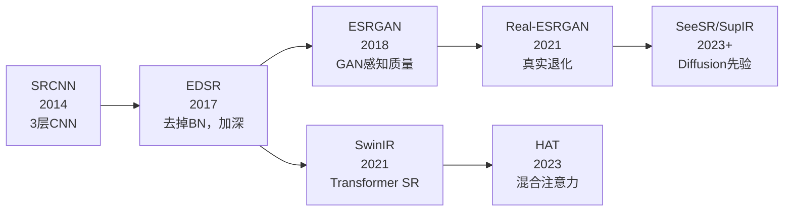

# SRCNN：超分辨率入门

上级笔记：[[CV学习总路线图]]
相关笔记：[[SegFormer-语义分割入门]] · [[YOLOv11-目标检测入门]]

---

## 历史发展背景

超分辨率是一个比深度学习更古老的课题，经历了三个时代：

**时代一：传统插值（1990s–2010s）**

| 方法 | 思路 | 问题 |
|------|------|------|
| 最近邻插值 | 直接复制最近像素 | 块状、锯齿明显 |
| 双线性插值 | 2×2 邻域加权平均 | 边界模糊 |
| 双三次插值（Bicubic）| 4×4 邻域三次多项式 | 更平滑，但高频细节缺失 |

插值方法不"学习"任何图像先验——只做数学平均，永远无法还原缺失的纹理。

**时代二：稀疏编码/字典学习（2010–2013）**

- **SCSR**（Yang et al., 2010）：建立 LR-HR patch 对应字典，推理时查字典重建
- **A+**（Timofte et al., 2014）：学习局部线性回归映射
- 问题：特征是手工设计的，推理慢（逐 patch 处理），泛化能力有限

**时代三：深度学习（2014–今）**

SRCNN（2014）是从"手工特征+字典查找"到"端到端数据驱动"的转折点。

---

## 什么是超分辨率

输入一张模糊的低分辨率图，输出一张清晰的高分辨率图。

```
低清输入 (LR)  →  SRCNN  →  高清输出 (SR)  ≈  真实高清图 (HR)
```

和目标检测/语义分割不同，这是一个 **Image-to-Image** 任务——输入是图，输出也是图，没有类别标签。

---

## 数据集的构造方式

超分辨率不需要人工标注——LR/HR 对可以自动生成：

```
原始高清图 (HR)
    ↓ 缩小 N 倍（模拟"拍糊了"）
低分辨率图 (LR)
    ↓ 双线性/双三次插值放大回原尺寸
模型输入      →  模型尝试还原出 HR
```

本项目复用了 VOC2012 的 JPEGImages（1464 张），动态生成 LR/HR patch 对，无需额外下载数据。

---

## SRCNN 架构（2014, Dong et al.）

深度学习用于超分辨率的第一篇论文。结构极简：**3 层卷积**，共 20,099 个参数。

```
输入 LR 图（已双三次插值到目标尺寸）
    ↓
Conv1: 3→64, kernel=9×9   特征提取（大卷积核，感受野宽）
    ↓ ReLU
Conv2: 64→32, kernel=1×1  非线性映射（逐通道变换）
    ↓ ReLU
Conv3: 32→3,  kernel=5×5  重建输出（无激活函数）
    ↓
输出 SR 图（和输入同尺寸，但细节更清晰）
```

> [!NOTE] 为什么 Conv3 没有激活函数
> 输出像素值需要是连续的实数（如 0.73、0.82），ReLU 会截断负值，导致暗色区域出错。
> 分类任务最后一层也不加激活函数，原理相同。

### 与 SegFormer 的对比

| | SRCNN | SegFormer-B0 |
|--|--|--|
| 参数量 | **20,099** | 3,700,000 |
| 文件大小 | <1 MB | 14 MB |
| 架构类型 | 纯 CNN | Transformer |
| 输出 | 像素值（回归）| 像素类别（分类）|

---

## 损失函数：MSE

```python
criterion = nn.MSELoss()
loss = criterion(pred_hr, true_hr)
```

MSE = 预测图和真实图每个像素差值的平方均值。

与语义分割的 CrossEntropy 不同：
- CrossEntropy：预测"这个像素是第几类"（分类问题）
- MSE：预测"这个像素的颜色值是多少"（回归问题）

---

## 评价指标：PSNR

**Peak Signal-to-Noise Ratio（峰值信噪比）**，单位 dB，越高越好。

```
PSNR = 20 × log10(1.0 / sqrt(MSE))
```

| PSNR | 主观感受 |
|------|---------|
| < 25 dB | 明显模糊 |
| 25–30 dB | 一般质量，轻微模糊 |
| 30–35 dB | 较好，接近原图 |
| > 35 dB | 难以区分 |

PSNR 和 MSE 之间是单调关系——MSE 越小，PSNR 越高。训练时用 MSE 作 loss，验证时换算成 PSNR 更直观。

---

## 实验结果

代码路径：[`projects/srcnn/`](../../projects/srcnn/)

→ 见 [[srcnn-exp1-结果]]

---

## 关键限制

1. **已丢失的信息无法还原**：缩小时消失的细节（如船体上的小字），任何 SR 方法都无法凭空重建
2. **平滑区域帮助有限**：天空、墙面等低频区域，SRCNN 和 Bicubic 差距极小
3. **高对比边缘改善最明显**：文字、轮廓、纹理边界提升最大

这也是为什么后来的 ESRGAN、Real-ESRGAN 要用更深的网络和感知损失（Perceptual Loss）——MSE 优化的是平均像素误差，不是人眼感知的清晰度。

---

## 研究前沿与最新进展

### 技术演进时间线



### 两条技术路线的分叉

**路线 A：像素精度路线**（SRCNN → EDSR → SwinIR → HAT）
- 目标：最高 PSNR / SSIM
- 代价：输出是"所有可能清晰图的期望"——倾向于平滑，细节略微过拟合
- 代表：HAT（Hybrid Attention Transformer, 2023）

**路线 B：感知质量路线**（ESRGAN → Real-ESRGAN → Diffusion-based）
- 目标：人眼感觉清晰，可接受 PSNR 偏低
- 方法：GAN 或 Diffusion 生成"某一种"高频细节
- 代表：Real-ESRGAN（处理真实世界复杂退化）、SeeSR / SupIR（以 Stable Diffusion 为先验）

> [!NOTE] PSNR 与感知质量的根本矛盾
> MSE/PSNR 鼓励输出"所有可能清晰图的平均"（模糊但安全），而人眼喜欢"有一种清晰细节"（某些像素偏差大，PSNR 低）。
> 这是图像复原领域的根本张力。Diffusion 模型的兴起，本质上是对这个矛盾的回答——用概率采样代替期望估计。

### ESRGAN vs SRCNN 核心差异

| | SRCNN | ESRGAN |
|--|--|--|
| 网络深度 | 3 层 | 23 个 RRDB 残差块 |
| Loss | MSE | MSE + 感知 Loss + GAN Loss |
| 输出特点 | 平滑，PSNR 高 | 有细节，PSNR 略低但视觉清晰 |
| 训练难度 | 简单稳定 | GAN 训练不稳定 |

### Real-ESRGAN：为什么需要它

SRCNN 和 ESRGAN 都假设退化是"简单的 Bicubic 下采样"。但真实世界的低质量图像退化复杂得多：压缩噪声 + 运动模糊 + 传感器噪声 + 分辨率不足 混合叠加。

Real-ESRGAN 用**随机混合退化管线**合成训练数据，让模型学会处理真实世界的复杂退化。

### 2025–2026 最新动向

**三条技术路线并行演进：Transformer、Diffusion、Mamba**

| 年份 | 模型 | 核心贡献 |
|------|------|---------|
| 2025 | DiT-SR（AAAI 2025）| 将 DiT（Diffusion Transformer）引入 SR，超越此前所有从头训练的扩散 SR 方法 |
| 2025 | ODTSR | 单步扩散 Transformer，同时兼顾保真度与可控性，支持文字提示控制增强效果 |
| 2025 | CATformer | Contrastive Adversarial Transformer，结合 GAN 对抗训练 + Transformer，填补三条路线之间的性能差距 |
| 2025 | BiMaCoSR | 二值化单步扩散模型，极度压缩推理成本 |

**新兴架构：Mamba**
Mamba（State Space Model）开始进入 SR 领域，与 Transformer 相比具有线性复杂度，对超高分辨率图像（4K+）更友好。

→ 下一站：[[DDPM-扩散模型入门]]（扩散先验如何用于超分辨率）
