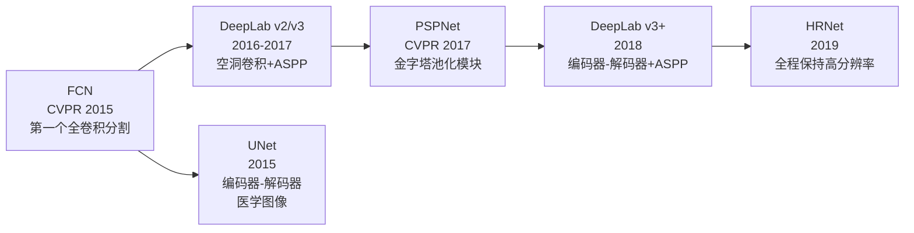
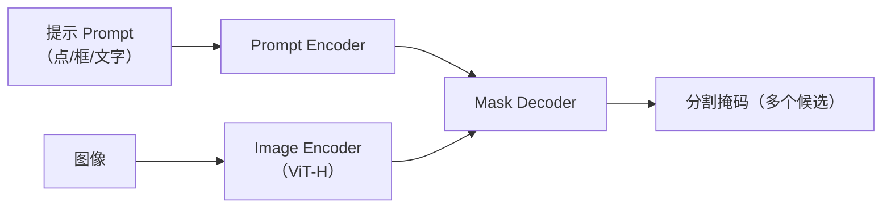

# SegFormer：语义分割入门

上级笔记：[[CV学习总路线图]]
相关笔记：[[YOLOv11-目标检测入门]] · [[迁移学习与微调]]

---

## 历史发展背景

语义分割从"图像分类"演变而来，核心挑战是如何让网络同时理解"全局语义"和"精确像素位置"。

### 传统方法（2000s–2014）

- **GrabCut / GraphCut**：交互式分割，需要人工提示前景/背景
- **超像素方法**（SLIC 等）：先聚类相似像素为超像素，再分类
- 问题：特征是手工设计的，无法学习语义

### 深度学习早期（2015–2020）



**FCN（Long et al., CVPR 2015）**：分割领域的奠基工作
- 把 VGG/AlexNet 的最后几个全连接层替换成卷积层
- 用**转置卷积（反卷积）**上采样恢复空间分辨率
- 首次实现端到端、任意尺寸输入的密集预测

**空洞卷积（Atrous/Dilated Convolution）**：DeepLab 系列的核心创新
- 在不增加参数的情况下扩大感受野（插入空洞）
- ASPP（Atrous Spatial Pyramid Pooling）：用多个膨胀率并行采样，捕获多尺度上下文

**PSPNet**：在特征图上做全局平均池化，强制网络看到整张图的信息（解决 FCN 只有局部感受野的问题）。

### 从 CNN 到 Transformer（2021）

ViT（Vision Transformer）2020 年证明纯 Transformer 能做分类，随即出现 SETR 等把 ViT 用于分割的工作，但计算代价极高。
SegFormer（2021）设计了分层 MiT 编码器，在效率和精度之间找到平衡。

---

## 语义分割 vs 目标检测

| 维度 | 目标检测（YOLO）| 语义分割（SegFormer）|
|------|--------------|-------------------|
| 输出 | 每个物体一个边界框 + 类别 | 每个**像素**一个类别标签 |
| 粒度 | 物体级别 | 像素级别 |
| 区分个体 | ✅（能区分"第1个人"和"第2个人"）| ❌（只知道"这里是人"）|
| 典型应用 | 计数、追踪 | 自动驾驶场景解析、医学图像 |
| 评价指标 | mAP | **mIoU**（平均交并比）|

> [!NOTE] 语义分割的"语义"
> "语义"指每个像素有语言含义（天空/道路/人），区别于"实例分割"（还能区分第1棵树和第2棵树）。

---

## SegFormer 架构

发表于 NeurIPS 2021（论文：SegFormer: Simple and Efficient Design for Semantic Segmentation with Transformers）

```
输入图像 (H×W×3)
    │
    ▼
┌─────────────────────────────┐
│  Mix Transformer 编码器 (MiT) │  ← 提取多尺度特征
│  Stage 1: H/4 × W/4         │
│  Stage 2: H/8 × W/8         │
│  Stage 3: H/16 × W/16       │
│  Stage 4: H/32 × W/32       │
└─────────────────────────────┘
    │ 四个尺度的特征图
    ▼
┌─────────────────────────────┐
│  All-MLP 解码器              │  ← 汇聚多尺度特征
│  每个尺度 → Linear 投影       │
│  统一上采样到 H/4 × W/4       │
│  拼接 → Linear → 分割图       │
└─────────────────────────────┘
    │
    ▼
输出分割图 (H/4 × W/4 × num_classes)
→ 双线性上采样到原始尺寸 (H×W×num_classes)
```

### 编码器：Mix Transformer (MiT)

SegFormer 的编码器是专门为分割设计的分层 Transformer。

**关键设计一：无位置编码（No Positional Encoding）**
- 普通 ViT 用固定的位置编码，推理时如果分辨率不同就会出错
- MiT 用 Mix-FFN 里的深度卷积代替位置信息，自动感知局部位置
- 好处：可以在任意分辨率输入上推理

**关键设计二：重叠 Patch Embedding**
- 普通 ViT 把图切成不重叠的 patch，边界处丢失局部连续性
- MiT 用有重叠的卷积窗口，patch 之间共享边界像素

**关键设计三：高效自注意力（Efficient Self-Attention）**
```
标准注意力：Q × K^T 的复杂度 O(N²)  N = 序列长度（像素数）
MiT 注意力：先把 K/V 用 stride 卷积缩减长度，复杂度降到 O(N²/R²)
```

### 解码器：All-MLP

SegFormer 的解码器故意设计得非常简单：
- 4 个 Linear 层（每个尺度一个）
- 上采样到统一大小
- 拼接后再一个 Linear 输出分类

这与 FPN（Feature Pyramid Network）等复杂解码器相反——论文证明，好的编码器可以弥补简单解码器的缺点。

### 模型系列（B0 → B5）

| 版本 | 参数量 | 速度 | ADE20K mIoU |
|------|--------|------|------------|
| B0 | 3.7M | 最快 | 37.4 |
| B1 | 13.7M | | 42.2 |
| B2 | 25.4M | | 46.5 |
| B3 | 44.1M | | 48.5 |
| B4 | 64.1M | | 50.3 |
| B5 | 84.7M | 最慢 | 51.8 |

> [!TIP] 入门推荐 B0
> B0 参数量是 YOLO11s（9.4M）的 1/3，CPU 上可以跑起来。

---

## 评价指标：mIoU

**IoU（Intersection over Union）= 交集面积 / 并集面积**

```
预测像素集合: ████████
真实像素集合:     ████████

交集 = ████
并集 = ████████████

IoU = |交集| / |并集| = 4/12 ≈ 0.33
```

**mIoU = 所有类别 IoU 的平均值**

与 mAP 的对比：
- mAP：框的精度（检测任务）
- mIoU：像素的精度（分割任务）
- mIoU=0.5 表示预测的像素区域平均有一半和真实区域重叠——这在分割里算中等

---

## 数据集：PASCAL VOC 2012

- **类别数**：20 个物体类 + 1 个背景 = **21 类**
- **类别**：人、车、飞机、自行车、鸟、船、瓶子、巴士、猫、椅子、牛、餐桌、狗、马、摩托车、盆栽、羊、沙发、火车、显示器
- **训练集**：1,464 张（+ SBD 扩充后 10,582 张）
- **验证集**：1,449 张
- **标注格式**：PNG 调色板图，每个像素的值 = 类别 id（255 = 忽略区域）
- **图像大小**：不固定，通常 500×375 左右

与足球数据集对比：
| | 足球 | VOC2012 |
|---|---|---|
| 类别 | 3 | 21 |
| 训练图像 | ~1800 | 1464 |
| 标注 | bbox (YOLO格式) | pixel mask (PNG) |
| 评价指标 | mAP | mIoU |

---

## 实现路径（HuggingFace）

### 方案一：微调预训练模型（推荐入门）

```python
from transformers import SegformerForSemanticSegmentation, SegformerImageProcessor
import torch

# 加载预训练 B0（在 ADE20K 上预训练）
processor = SegformerImageProcessor.from_pretrained("nvidia/mit-b0")
model = SegformerForSemanticSegmentation.from_pretrained(
    "nvidia/mit-b0",
    num_labels=21,          # VOC2012 的类别数
    ignore_mismatched_sizes=True  # 替换原来的分类头
)

# 前向传播
inputs = processor(images=image, return_tensors="pt")
outputs = model(**inputs)
logits = outputs.logits  # shape: (batch, 21, H/4, W/4)

# 上采样回原始尺寸
upsampled = torch.nn.functional.interpolate(
    logits, size=image.size[::-1], mode="bilinear", align_corners=False
)
pred_mask = upsampled.argmax(dim=1)  # shape: (batch, H, W)
```

### 加载 VOC2012 数据集

```python
import torchvision.datasets as datasets
import torchvision.transforms as transforms

train_dataset = datasets.VOCSegmentation(
    root="./data",
    year="2012",
    image_set="train",   # 或 "trainval"
    download=True,       # 第一次自动下载 (~2GB)
    transform=transforms.Compose([
        transforms.Resize((512, 512)),
        transforms.ToTensor(),
    ]),
    target_transform=transforms.Compose([
        transforms.Resize((512, 512), interpolation=transforms.InterpolationMode.NEAREST),
        transforms.PILToTensor(),
    ]),
)
```

> [!WARNING] target_transform 用 NEAREST 插值
> 分割 mask 的每个像素值是类别 id（整数），不能用双线性插值，否则会产生不存在的类别 id。

### 损失函数

```python
# 语义分割标准损失：像素级交叉熵
criterion = torch.nn.CrossEntropyLoss(ignore_index=255)  # 255 = 边界像素，忽略

loss = criterion(logits, target_masks)
```

---

## 与 YOLO 的对比（帮助建立直觉）

| 概念 | YOLO（检测）| SegFormer（分割）|
|------|-----------|----------------|
| 输出形状 | `(B, anchors, 5+C)` | `(B, C, H/4, W/4)` |
| 损失 | box_loss + cls_loss + dfl_loss | CrossEntropyLoss（像素级）|
| 后处理 | NMS（非极大值抑制）| 直接 argmax 取最大类 |
| 评价 | mAP50, mAP50-95 | mIoU（每类 + 平均）|
| 标注格式 | .txt（归一化坐标）| .png（像素 id 图）|

---

## 研究前沿与最新进展

### Mask2Former：统一分割（Cheng et al., CVPR 2022）

SegFormer 是"语义分割专用"的；Mask2Former 的目标是**一个模型统一处理三种分割任务**：
- 语义分割（每个像素属于哪个类）
- 实例分割（区分同类不同个体）
- 全景分割（语义 + 实例）

核心创新：**Masked Attention**
```
普通 Transformer：每个 Query 关注全图所有位置
Masked Attention：每个 Query 只关注预测的前景区域
→ 减少无关背景干扰，收敛更快，精度更高
```

### SAM：分割基础模型（Kirillov et al., ICCV 2023）

Meta AI 的 Segment Anything Model（SAM）重新定义了分割：
- 不再是"给定类别列表，预测每类区域"
- 而是"**给定任意提示（点/框/文字），分割对应区域**"
- 在 1100 万张图的 SA-1B 数据集上训练，具有强大的零样本泛化能力



SAM 的意义：从"任务特定模型"走向"基础模型 + 提示工程"，类似 GPT 对 NLP 的影响。

### SAM2（2024）：扩展到视频

SAM2 将 SAM 从静态图像扩展到视频：
- 引入**记忆库（Memory Bank）**，在帧间传递分割状态
- 在 SA-V 数据集（5 万视频）上训练
- 支持视频中的零样本目标追踪 + 分割

### 开放词汇分割

结合 CLIP 等视觉语言模型，实现不限类别的开放词汇分割：
- **CLIP** 提供视觉-语言对齐能力
- 输入任意文本描述，分割对应区域
- 代表：FC-CLIP、ODISE 等

### 当前格局（2025）

| 方向 | 代表模型 | 应用场景 |
|------|---------|---------|
| 精度 SOTA | Mask2Former, OneFormer | 竞赛、学术 benchmark |
| 基础模型 | SAM、SAM2 | 通用分割，零样本 |
| 开放词汇 | FC-CLIP, ODISE | 任意类别分割 |
| 实时部署 | SegFormer-B0, MobileViT | 端侧/嵌入式 |

> [!NOTE] SegFormer 在当前的定位
> SegFormer 在 ADE20K 等 benchmark 上已不是 SOTA，但其轻量、快速、代码简洁的特点使它仍是工程部署和入门学习的首选。

---

## 下一步：实验计划

→ 见 [[seg-exp1-计划]] （待创建）

实验目标：
1. 跑通完整的 SegFormer + VOC2012 训练循环
2. 理解分割数据集的 DataLoader 写法（自定义 Dataset 类）
3. 实现 mIoU 计算
4. 对比 B0 微调 vs 从头训练的效果差异
