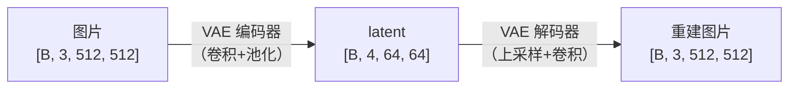
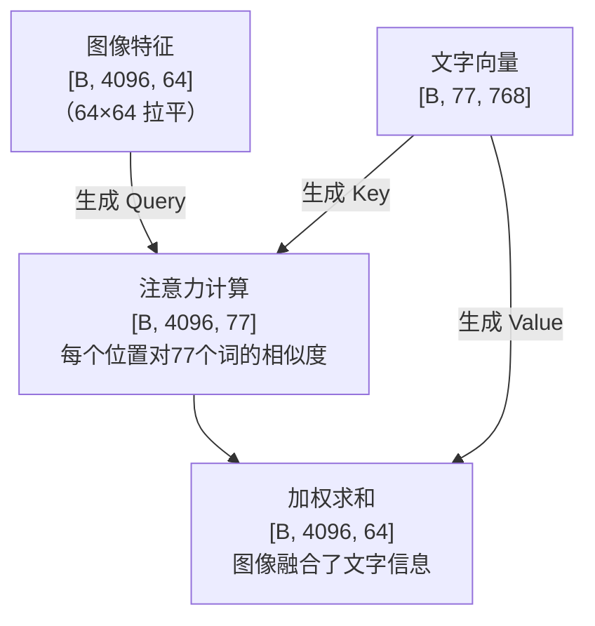
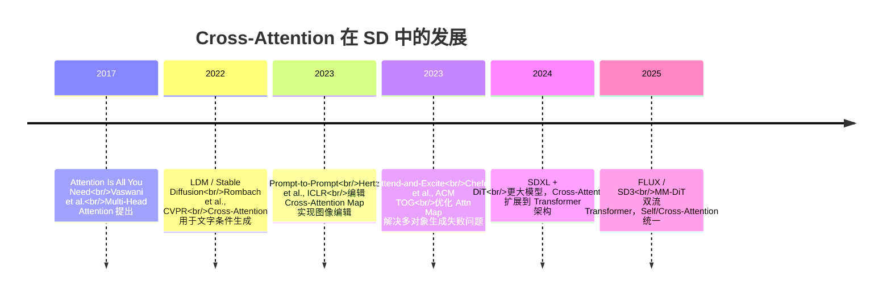
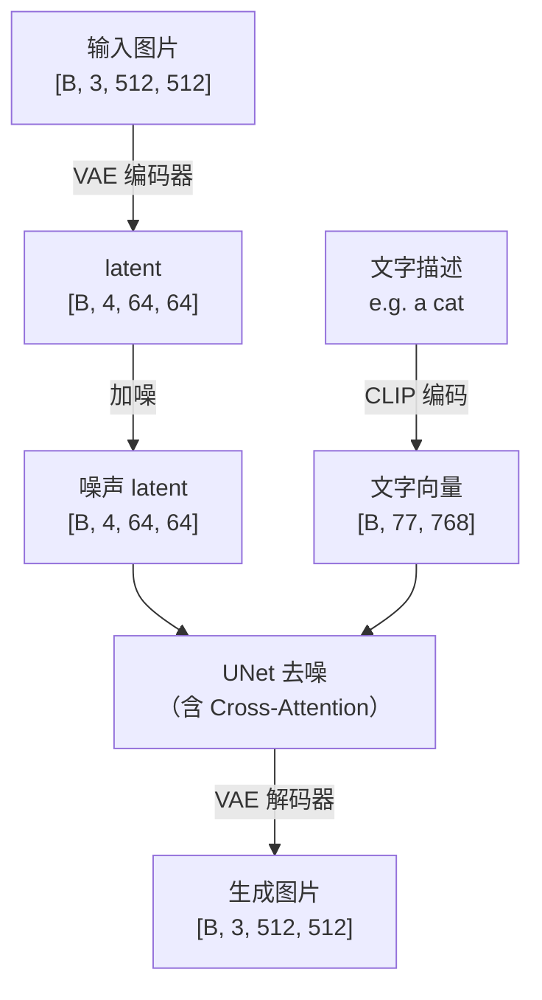

# Stable Diffusion：VAE 与 Cross-Attention

上级笔记：[[DDPM-扩散模型入门]]
相关笔记：[[Tensor-Shape追踪指南]] · [[SegFormer-语义分割入门]]

---

## 从 DDPM 到 Stable Diffusion

DDPM 在 28×28 的像素空间直接做扩散。如果换成 512×512 的彩色图：

| | DDPM | SD |
|---|---|---|
| 输入尺寸 | 28×28×1 = 784 个数 | 512×512×3 = 786432 个数 |
| 计算量 | 基准 | 约 1000 倍 |
| 训练时间 | 数小时 | 数周 |

**解决方案：** 不在像素空间做扩散，先用 VAE 压缩到隐空间，在小空间里扩散，再解码回来。

---

## VAE：压缩工具

VAE（Variational Autoencoder）结构和 UNet 编解码器完全相同：编码器压缩，解码器恢复。



**压缩比：** 512÷64 = 8 倍（空间），计算量缩小约 48 倍。

**通道 3→4：** 不是颜色层，是 VAE 自己学出来的 4 种压缩编码，包含重建图片所需的所有关键信息。

**重建质量：** 几乎无损——VAE 在大量图片上训练后，4 个通道足以保留视觉细节。

### Colab 验证实验

```python
from diffusers import AutoencoderKL
vae = AutoencoderKL.from_pretrained("stabilityai/sd-vae-ft-mse")

latent = vae.encode(x).latent_dist.sample()  # [1,3,512,512] → [1,4,64,64]
output = vae.decode(latent).sample           # [1,4,64,64] → [1,3,512,512]
# 结果：原图与重建图视觉上几乎无差异
```

---

## CLIP 文字编码

SD 需要文字条件控制生成内容。文字是字符串，模型只能处理 tensor，所以先用 CLIP 编码：

```
"a cat on the beach"
        ↓ CLIP 文字编码器
  [1, 77, 768]
   ↑   ↑    ↑
batch 词数  每词维度
```

- **77**：最多 77 个 token（词/子词）
- **768**：每个词映射成 768 维向量，由 CLIP 训练学出来

语义相近的词在 768 维空间里距离近：
```
"cat" ≈ "dog"  →  向量相近
"cat" ≠ "car"  →  向量差异大
```

---

## Cross-Attention：文字进入图像

Self-Attention 是图像内部的交流（每个位置问其他位置）。
Cross-Attention 是图像向文字查询。

**大白话：** 画家（图像）看着文字描述，画布上每个位置问"我该参考哪个词？"



| 角色 | 来源 | 含义 |
|------|------|------|
| Q（Query） | 图像特征 | "我这个位置想查询什么" |
| K（Key） | 文字向量 | "我是第X个词的标签" |
| V（Value） | 文字向量 | "我是第X个词的具体内容" |

每个图像位置拿 Q 和所有词的 K 算相似度，相似度高的词权重大，最后用权重把 V 加权融合进图像。

### 完整计算公式

```
Attention(Q, K, V) = softmax( Q @ K^T / √d ) @ V
```

| 步骤 | 操作 | 输出 shape |
|------|------|-----------|
| 相似度 | Q @ K^T | [B, 4096, 77] |
| 缩放 | ÷ √d | [B, 4096, 77] |
| 归一化 | softmax（按行） | [B, 4096, 77]，每行加和=1 |
| 加权融合 | 权重 @ V | [B, 4096, 320] |

---

## 为什么要除以 √d（缩放因子）

**问题根源：** 维度 d 越大，Q @ K^T 的点积量级越大。

随机初始化时，d 维点积的量级约等于 √d：
```
d = 2   →  量级 ≈ 1.4
d = 320 →  量级 ≈ 17.9   ← SD 实际使用
```

**大数进入 softmax 的后果：**

```
softmax([1.0, 1.1, 0.9])  →  [0.31, 0.38, 0.31]  ← 分散，正常
softmax([100, 110, 90 ])  →  [0.00, 1.00, 0.00]  ← 尖锐，只盯一个词
```

softmax 极度尖锐时：
- 注意力退化为只看一个 token，失去分散关注的能力
- 梯度趋近于 0，W_Q / W_K 无法更新，训练失败

**解决方案：** 除以 √d，把点积压回量级 ≈ 1，softmax 保持软分布，梯度正常流动。

---

## Multi-Head Cross-Attention

单头注意力只能学到一种"关注模式"。Multi-Head 把注意力空间拆成 N 份，每个头独立学习不同模式：

```
头 1：关注语义（"猫"→毛茸茸纹理区域）
头 2：关注位置（"左边的猫"→左侧空间）
头 3：关注风格（"水彩画"→整体色调区域）
...共 8 个头，并行不干扰
```

### 核心关系

```
d_model = heads × dim_head
  512   =   8   ×    64      ← SD1.5 实际配置
```

### 拆头 / 合并头的 Tensor 操作

```
拆头：
  [B, seq, 512]
    → reshape → [B, seq, 8, 64]
    → permute → [B, 8, seq, 64]   ← 8 个头并行

合并头（完全对称）：
  [B, 8, seq, 64]
    → permute → [B, seq, 8, 64]
    → reshape → [B, seq, 512]     ← 8 消失，合并进 512
```

### 完整代码（含 shape 注释）

```python
class CrossAttention(nn.Module):
    def __init__(self, dim, context_dim, heads=8, dim_head=64):
        super().__init__()
        inner_dim = heads * dim_head          # 512
        self.heads = heads
        self.dim_head = dim_head
        self.scale = dim_head ** -0.5         # 1/√64

        self.to_q = nn.Linear(dim, inner_dim, bias=False)
        self.to_k = nn.Linear(context_dim, inner_dim, bias=False)
        self.to_v = nn.Linear(context_dim, inner_dim, bias=False)
        self.to_out = nn.Linear(inner_dim, dim)

    def forward(self, x, context):
        # x: 图像特征 [B, seq_img, dim]
        # context: CLIP 文字向量 [B, seq_txt, 768]
        B, N, _ = x.shape
        H = self.heads

        Q = self.to_q(x)        # [B, seq_img, 512]  ← 投影到同一空间
        K = self.to_k(context)  # [B, seq_txt, 512]
        V = self.to_v(context)  # [B, seq_txt, 512]

        # 拆头
        Q = Q.reshape(B, N, H, self.dim_head).permute(0, 2, 1, 3)   # [B, 8, seq_img, 64]
        K = K.reshape(B, -1, H, self.dim_head).permute(0, 2, 1, 3)  # [B, 8, seq_txt, 64]
        V = V.reshape(B, -1, H, self.dim_head).permute(0, 2, 1, 3)  # [B, 8, seq_txt, 64]

        # 注意力计算（8 个头同时并行）
        attn = (Q @ K.transpose(-1, -2)) * self.scale  # [B, 8, seq_img, seq_txt]
        attn = attn.softmax(dim=-1)                    # 每行变成概率分布
        out  = attn @ V                                 # [B, 8, seq_img, 64] ← 文字内容

        # 合并头
        out = out.permute(0, 2, 1, 3).reshape(B, N, -1)  # [B, seq_img, 512]
        return self.to_out(out)                            # [B, seq_img, dim]
```

### 三个固定参数的来源

| 参数 | 值 | 谁定的 | 含义 |
|------|-----|--------|------|
| `context_dim = 768` | CLIP ViT-L/14 输出维度 | OpenAI（CLIP 作者） | 每个文字 token 的语义向量大小 |
| `dim = 320/640/1280` | UNet 各层 channel 数 | Stability AI | 图像特征维度，不同深度不同 |
| `heads = 8` | 注意力头数 | Stability AI（可调超参） | 并行关注模式数量 |

> **CLIP vs GPT 的关键区别：**  
> GPT 预测下一个 token（生成文字）；CLIP 把整句话编码成语义向量（理解文字）。  
> SD 用的是 CLIP 的理解能力，不是 GPT 的生成能力。

---

## 关键超参数（SD 1.5）

来源：Rombach et al., "High-Resolution Image Synthesis with Latent Diffusion Models", CVPR 2022

| 参数 | 值 | 调参方向 |
|------|-----|---------|
| attention heads | 8 | 更多头 → 更丰富的关注模式，但显存增加 |
| dim_head | 64 | 与 heads 乘积决定 inner_dim |
| context_dim | 768 | 由 CLIP 模型固定，不可改 |
| Cross-Attn 所在分辨率 | 64×64, 32×32, 16×16, 8×8 | 多分辨率嵌入让文字在不同尺度生效 |
| VAE 压缩比 | 8× (512→64) | 固定 |
| latent channels | 4 | 固定 |

---

## 研究前沿与最新进展



### 代表性后续工作

**Prompt-to-Prompt（ICLR 2023）**  
发现图像的空间布局由 Cross-Attention Map 决定。通过替换或混合不同 prompt 的注意力图，可以在保持结构不变的前提下修改语义（如"狗"→"猫"，姿势不变）。

**Attend-and-Excite（ACM TOG 2023）**  
解决 SD 多对象生成失败问题（如"红色猫和蓝色狗"可能只生成一种）。在推理中监控 Cross-Attention Map，对关注度不足的 token 施加 loss 强制激活。

**MM-DiT（FLUX / SD3, 2024-2025）**  
用 Diffusion Transformer 替换 UNet，文字和图像 token 在同一序列里做 Full Attention，不再区分 Self/Cross，语义对齐更精准。

---

## SD 完整数据流



**扩散在哪里发生：** latent 空间（64×64），而不是像素空间（512×512）。

---

## 与 DDPM 的对比

| | DDPM | Stable Diffusion |
|---|---|---|
| 扩散空间 | 像素空间 28×28 | 隐空间 64×64 |
| 文字条件 | 无（或类别标签） | CLIP 文字编码 + Cross-Attention |
| 注意力类型 | Self-Attention（瓶颈处） | Self-Attention + Cross-Attention |
| 实用性 | 研究用 | 可生成高质量 512×512 图片 |
