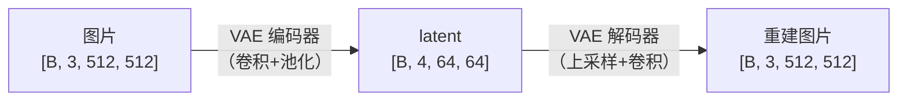
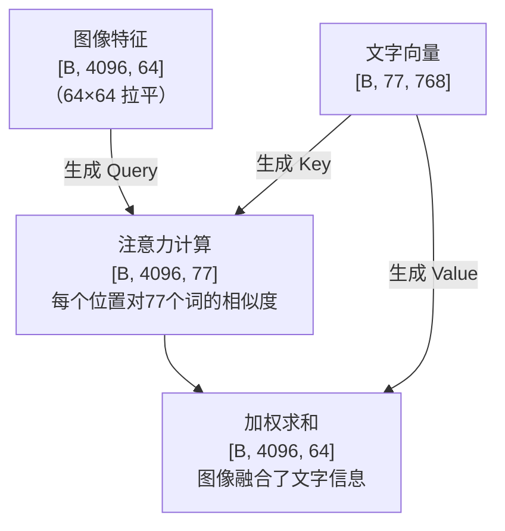
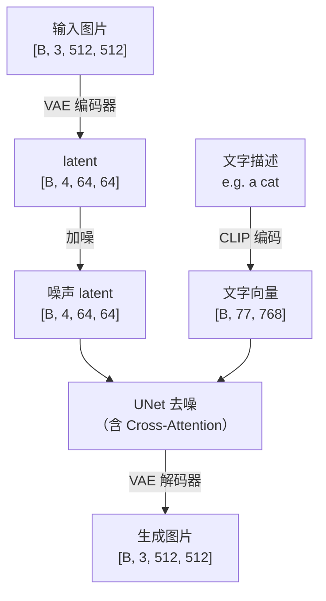

# Stable Diffusion：VAE 与 Cross-Attention

上级笔记：[[DDPM-扩散模型入门]]
相关笔记：[[Tensor-Shape追踪指南]] · [[SegFormer-语义分割入门]]

---

## 从 DDPM 到 Stable Diffusion

DDPM 在 28×28 的像素空间直接做扩散。如果换成 512×512 的彩色图：

| | DDPM | SD |
|---|---|---|
| 输入尺寸 | 28×28×1 = 784 个数 | 512×512×3 = 786432 个数 |
| 计算量 | 基准 | 约 1000 倍 |
| 训练时间 | 数小时 | 数周 |

**解决方案：** 不在像素空间做扩散，先用 VAE 压缩到隐空间，在小空间里扩散，再解码回来。

---

## VAE：压缩工具

VAE（Variational Autoencoder）结构和 UNet 编解码器完全相同：编码器压缩，解码器恢复。



**压缩比：** 512÷64 = 8 倍（空间），计算量缩小约 48 倍。

**通道 3→4：** 不是颜色层，是 VAE 自己学出来的 4 种压缩编码，包含重建图片所需的所有关键信息。

**重建质量：** 几乎无损——VAE 在大量图片上训练后，4 个通道足以保留视觉细节。

### Colab 验证实验

```python
from diffusers import AutoencoderKL
vae = AutoencoderKL.from_pretrained("stabilityai/sd-vae-ft-mse")

latent = vae.encode(x).latent_dist.sample()  # [1,3,512,512] → [1,4,64,64]
output = vae.decode(latent).sample           # [1,4,64,64] → [1,3,512,512]
# 结果：原图与重建图视觉上几乎无差异
```

---

## CLIP 文字编码

SD 需要文字条件控制生成内容。文字是字符串，模型只能处理 tensor，所以先用 CLIP 编码：

```
"a cat on the beach"
        ↓ CLIP 文字编码器
  [1, 77, 768]
   ↑   ↑    ↑
batch 词数  每词维度
```

- **77**：最多 77 个 token（词/子词）
- **768**：每个词映射成 768 维向量，由 CLIP 训练学出来

语义相近的词在 768 维空间里距离近：
```
"cat" ≈ "dog"  →  向量相近
"cat" ≠ "car"  →  向量差异大
```

---

## Cross-Attention：文字进入图像

Self-Attention 是图像内部的交流（每个位置问其他位置）。
Cross-Attention 是图像向文字查询。

**大白话：** 画家（图像）看着文字描述，画布上每个位置问"我该参考哪个词？"



| 角色 | 来源 | 含义 |
|------|------|------|
| Q（Query） | 图像特征 | "我这个位置想查询什么" |
| K（Key） | 文字向量 | "我是第X个词的标签" |
| V（Value） | 文字向量 | "我是第X个词的具体内容" |

每个图像位置拿 Q 和所有词的 K 算相似度，相似度高的词权重大，最后用权重把 V 加权融合进图像。

---

## SD 完整数据流



**扩散在哪里发生：** latent 空间（64×64），而不是像素空间（512×512）。

---

## 与 DDPM 的对比

| | DDPM | Stable Diffusion |
|---|---|---|
| 扩散空间 | 像素空间 28×28 | 隐空间 64×64 |
| 文字条件 | 无（或类别标签） | CLIP 文字编码 + Cross-Attention |
| 注意力类型 | Self-Attention（瓶颈处） | Self-Attention + Cross-Attention |
| 实用性 | 研究用 | 可生成高质量 512×512 图片 |
