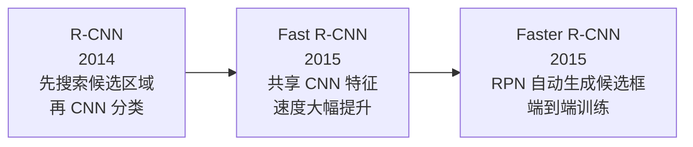
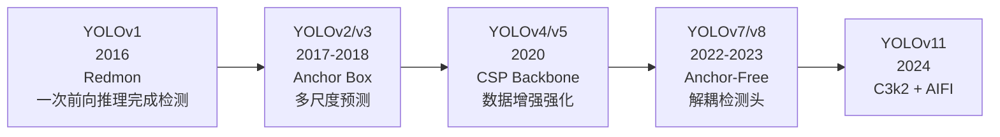
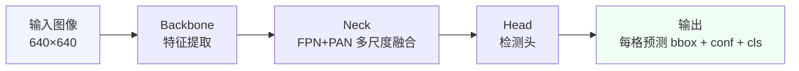
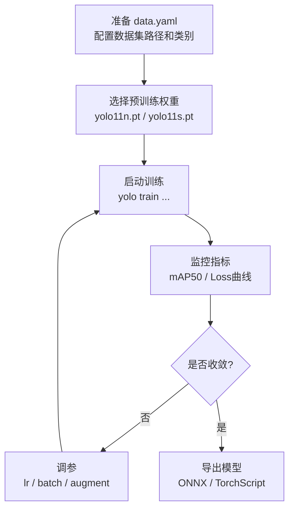
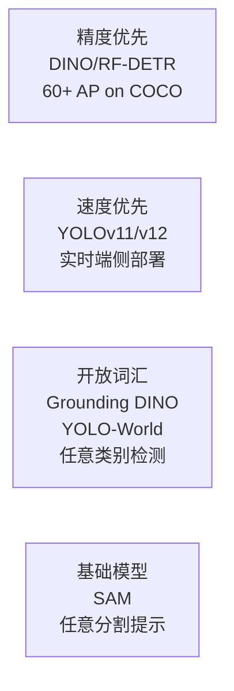

# YOLOv11 目标检测入门

## 项目背景

使用 Roboflow 公开数据集 **Futbol Players v9**（足球场景目标检测）入门 [[YOLO]] 系列模型。

- **数据集路径**：`/Users/quokka/Academic/datasets/raw/futbol-players-v9-yolov11/`
- **代码项目路径**：`/Users/quokka/Academic/projects/yolo-football/`
- **类别数**：3（ball-team1 / player-team2 / referee）
- **数据分区**：train / val / test

---

## 历史发展背景

目标检测经历了从"两阶段慢速"到"一阶段实时"的演进，YOLO 是一阶段方向的核心代表。

### 两阶段检测器（精度优先）



**R-CNN 的思路**：先用 Selective Search 生成 ~2000 个候选区域，再对每个区域单独跑 CNN 分类。推理极慢（单张图 ~47s）。

**Faster R-CNN** 是两阶段检测器的集大成者：用 Region Proposal Network（RPN）替换 Selective Search，整个流程端到端可训练，精度高但速度仍然有限（~5 FPS）。

### 一阶段检测器（速度优先）



**YOLOv1（2016）的革命性思想**：将检测视为回归问题，把图像划分为 S×S 网格，每个网格同时预测位置和类别，一次前向传播完成所有预测，速度提升到 45 FPS。

**Anchor Box 的引入（v2/v3）**：v1 直接预测坐标，v2 引入 Anchor Box（预定义形状的先验框），大幅提升小物体和不规则形状物体的检测精度。

**Anchor-Free 的回归（v8）**：YOLOv8 去掉 Anchor Box，直接预测中心点和宽高，简化训练，减少超参数依赖。

---

## YOLO 核心思路



YOLO 的核心思想是 **"将目标检测视为回归问题"**：把图像划分为 S×S 的网格，每个网格直接预测若干个 Bounding Box 及其置信度和类别概率，一次前向传播即可完成检测，速度极快。

与两阶段方法（如 [[Faster-RCNN]]）的对比：

| 维度 | YOLO（一阶段） | Faster-RCNN（两阶段） |
|------|--------------|---------------------|
| 速度 | 极快（实时） | 较慢 |
| 精度 | 略低（小目标） | 更高 |
| 部署 | 简单 | 复杂 |

---

## YOLOv11 改进点

相比 YOLOv8，YOLOv11 主要改进：

- **C3k2 模块**：替换原有 C2f，更高效的跨阶段特征融合
- **SPPF + A-ATSS**：改进的多尺度池化与自适应训练样本选择
- **更轻量的参数量**：在同等精度下模型更小

---

## 训练流程



### 关键训练命令

```bash
yolo train \
  model=yolo11s.pt \
  data=/Users/quokka/Academic/projects/yolo-football/configs/data.yaml \
  epochs=100 \
  imgsz=640 \
  batch=16 \
  project=/Users/quokka/Academic/projects/yolo-football/runs \
  name=exp1
```

---

## 关键指标说明

| 指标 | 含义 | 健康范围 |
|------|------|---------|
| `mAP50` | IoU=0.5 时的平均精度 | 越高越好，>0.7 算不错 |
| `mAP50-95` | IoU=0.5~0.95 综合精度 | 更严格，>0.5 算好 |
| `box_loss` | 边框回归损失 | 应持续下降 |
| `cls_loss` | 分类损失 | 应持续下降 |
| `dfl_loss` | 分布焦点损失（v8+新增） | 应持续下降 |

---

## 相关概念链接

- [[IoU]] - 交并比，目标检测的核心评价基础
- [[NMS]] - 非极大值抑制，过滤重叠预测框
- [[Anchor-Free]] - YOLOv8+ 采用无锚点设计
- [[数据增强]] - Mosaic、MixUp 等 YOLO 常用增强策略
- [[梯度消失]] - 深层网络训练的常见问题

---

## 实验记录

> 调参记录请见 `[[_03_Tuning_Logs/]]` 目录

---

## 研究前沿与最新进展

### DETR：用 Transformer 重新定义检测（2020）

DETR（Carion et al., ECCV 2020）打破了 YOLO 系列的 CNN 范式：
- 用 Transformer Encoder-Decoder 处理特征图
- 用 **可学习的 Object Queries** 代替 Anchor
- 用**匈牙利算法**做一一匹配，彻底去掉 NMS
- 问题：收敛慢（需要 500 epoch），小物体精度差

此后 Deformable DETR → DINO → RT-DETR 逐步改进这些缺陷。

### RT-DETR：实时无 NMS 检测（2023）

RT-DETR（Zhao et al., CVPR 2023）是 Baidu 提出的实时 DETR：
- 混合 CNN + Transformer 编码器，兼顾速度和精度
- 无需 NMS，端到端输出
- 在 COCO 上速度/精度超过同级别 YOLO

### 开放词汇检测：不限类别的检测

传统 YOLO 只能检测训练时见过的类别。新的研究方向：

| 模型 | 思路 | 特点 |
|------|------|------|
| Grounding DINO | 文本 + 视觉联合训练 | 输入文字描述就能检测任意物体 |
| YOLO-World | YOLO 速度 + 开放词汇 | 35.4 AP @ 52 FPS（V100）|
| RF-DETR（2025）| DETR + 大规模预训练 | COCO 54.7 mAP @ 4.5ms |

### 当前格局（2025）



> [!NOTE] YOLO 系列的意义
> YOLO 在学术 SOTA 上已不是第一，但工程部署价值极高——ONNX 导出、TensorRT 加速、手机端推理，YOLO 生态最完善。
> 学术前沿已向"开放词汇+基础模型"方向转移。

### 2025–2026 最新动向

| 年份 | 模型 | 核心贡献 |
|------|------|---------|
| NeurIPS 2025 | YOLOv12 | 首个注意力为核心的 YOLO，推理速度首次匹配 CNN 前代；2025 年 2 月发布 |
| 2026 年 1 月 | YOLO26 | 专为边缘/低功耗设备设计，全端到端无 NMS，Ultralytics 官方推荐新项目起点 |
| 2025 | RF-DETR | COCO 54.7 mAP @ 4.5ms（T4），结合 DETR 精度和实时推理速度 |

**YOLO26 的变化**：完全去掉 NMS 后处理，训练和部署流程进一步简化；针对边缘芯片（NPU/DSP）优化，是目前端侧部署的首选方向。

**当前格局（2026）**：

```
学术精度第一：RF-DETR / RT-DETR 系列
工程部署首选：YOLOv11 / YOLO26（Ultralytics 生态）
开放词汇检测：YOLO-World / Grounding DINO
```
