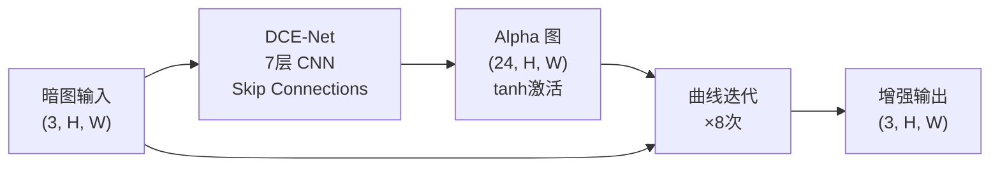
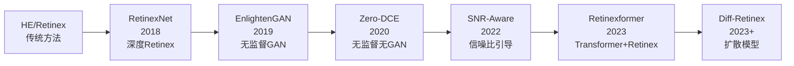

# Zero-DCE：低光照增强入门

上级笔记：[[CV学习总路线图]]
相关笔记：[[AODNet-图像去雾入门]] · [[SRCNN-超分辨率入门]]
实验日志：[[zerodce-exp1-结果]]

---

## 历史发展背景

低光照增强领域的独特之处在于：**真实配对数据极难获取**（同场景正常曝光图和低光照图需要同时拍摄），这推动了从"有监督"到"无监督"的方向转变。

### 传统方法（1970s–2010s）

**直方图均衡化（HE）**：最简单的全局增强，把像素亮度分布拉平到 0-255 全范围
- 问题：全局操作，过曝/欠曝并存；噪声也被放大

**Retinex 理论（Land & McCann, 1971）**：奠基性理论
```
图像 I = 光照 L × 反射率 R
去掉光照 L 的影响 → 恢复真实颜色和细节（反射率 R）
```
后续几十年的"去光照"算法都建立在这个理论上。

**LIME（Guo et al., TIP 2017）**：轻量级光照图估计
- 只估计光照分量 L，对 L 做 gamma 校正后用原图除以 L
- 速度快，但对噪声没有处理

### 深度学习早期（2018–2019）

| 年份 | 模型 | 思路 |
|------|------|------|
| 2018 | RetinexNet（Chen et al.）| 用 CNN 分解光照/反射率，第一个深度 Retinex 方法 |
| 2019 | EnlightenGAN | 第一个**无监督 GAN** 方法，不需要配对训练数据 |
| 2020 | Zero-DCE（本课题）| **无 GAN 的无监督**，用非参考 loss 彻底摆脱配对数据 |

Zero-DCE 相比 EnlightenGAN 的进步：不需要 GAN 训练（不稳定），完全用可解释的物理性质 loss 来监督。

---

## 和之前所有课题的根本区别

| | SRCNN / AOD-Net | Zero-DCE |
|--|--|--|
| 训练信号 | MSE(输出, GT) | 四个非参考 loss |
| 需要配对 GT | 是 | **否** |
| 学习目标 | "和正确答案相同" | "满足好图像的物理性质" |
| 训练范式 | 有监督 | **无监督** |

这解决了图像复原领域的根本问题：**真实退化图像几乎不存在配对 GT**。

---

## 核心思路：曲线估计

网络不直接预测清晰图，而是为每个像素预测一个**增强曲线参数 alpha**，然后用二次曲线迭代地把暗图拉亮：

```
LE_n = LE_{n-1} + alpha_n × LE_{n-1} × (1 - LE_{n-1})
```

- alpha > 0 → 拉亮
- alpha < 0 → 压暗
- 迭代 8 次，每次用不同的 alpha 图（空间自适应）

**为什么用这条曲线？**

这是一条过 (0,0) 和 (1,1) 的二次曲线，保证黑色还是黑色、白色还是白色，只改变中间调。



---

## 网络结构（DCE-Net）

7 层卷积，带对称 skip connection，参数量 **79,416**：

```
x1 = ReLU(conv1(x))           3→32
x2 = ReLU(conv2(x1))          32→32
x3 = ReLU(conv3(x2))          32→32
x4 = ReLU(conv4(x3))          32→32
x5 = ReLU(conv5([x3,x4]))     64→32   ← skip
x6 = ReLU(conv6([x2,x5]))     64→32   ← skip
alphas = tanh(conv7([x1,x6])) 64→24   ← 8次×3通道
```

---

## 四个非参考损失函数

这是 Zero-DCE 最核心的设计，每个 loss 把一条视觉先验知识编码成可微分的数学约束：

### 1. 空间一致性损失（Spatial Consistency）

```
问：增强前后，相邻区域的亮度差异还保持一致吗？
```

用局部均值池化后比较四邻域差值。**保留原图的空间结构，防止模型乱改局部对比度。**

### 2. 曝光控制损失（Exposure Control）⭐ 最关键

```
问：图像块的平均亮度是否接近正常曝光 E=0.6？
```

```python
loss = mean((AvgPool(gray) - 0.6)²)
```

**这是唯一告诉模型"要变亮"的 loss。去掉它，模型会找到退化解——输出原图，其他三个 loss 都是 0。**

> [!IMPORTANT] 退化解（Trivial Solution）
> 当模型可以通过"什么都不做"来最小化 loss 时，就会出现退化解。
> E=0.6 的曝光 loss 打破了这个捷径——不增亮就无法满足它。

### 3. 色彩恒常损失（Color Constancy）

```
问：RGB 三通道均值是否平衡（灰色世界假设）？
```

防止增强时偏色（整体偏红/偏蓝）。

### 4. 光照平滑损失（Illumination Smoothness）

```
问：alpha 曲线在空间上是否平滑（Total Variation）？
```

防止 alpha 图出现突变，避免块状伪影。

---

## 超参数含义

| 参数 | 值 | 含义 |
|------|-----|------|
| E | 0.6 | 目标曝光值，**定义了"好图"的亮度标准** |
| W_spa | 1 | 空间一致性权重 |
| W_exp | 10 | 曝光控制权重 |
| W_col | 5 | 色彩恒常权重 |
| W_tv | 200 | 光照平滑权重 |
| n_iter | 8 | 曲线迭代次数 |

**E 是领域先验知识的直接编码**——不是数学推导出来的，是摄影经验。改 E=0.9 → 过曝，改 E=0.3 → 仍然较暗。

---

## 病态问题与无监督训练

低光照增强和去雾一样是**病态问题**：给定暗图，对应的"正确"清晰图理论上有无数种。

Zero-DCE 的解法：不定义"正确答案"，而是定义"好图像应满足的性质"，用这些性质作为训练信号。这是无监督图像复原的一种范式。

→ 实验结果与诊断见 [[zerodce-exp1-结果]]

---

## 研究前沿与最新进展

### 技术演进时间线



### SNR-Aware（Xu et al., CVPR 2022）

Zero-DCE 对图像所有区域一视同仁，但低光照图像中：
- 亮区：信噪比高，直接增强即可
- 暗区：信噪比极低，增强时会把噪声也放大

SNR-Aware 用**信噪比图**作为软权重，对不同区域用不同的增强策略：暗区多去噪、亮区少处理。

### Retinexformer（Cai et al., ICCV 2023）

结合 Retinex 理论和 Transformer：
- 先用 CNN 估计光照图（Retinex 分解）
- 再用 Transformer 处理反射率（建模全局色彩一致性）
- 在 LOL 等标准 benchmark 上大幅超越 Zero-DCE 系列

### Diff-Retinex（2023）

将 Diffusion 模型引入低光照增强：
- 用 Retinex 分解网络拆分光照和反射率
- 用扩散模型对两个分量分别做生成式重建
- 可以处理 Zero-DCE 难以解决的极暗场景（严重噪声 + 颜色失真）

### 当前格局

| 方法 | 是否需要配对数据 | 主要优势 |
|------|----------------|---------|
| Zero-DCE | 否 | 无监督，速度快 |
| SNR-Aware | 是 | 自适应区域处理，PSNR 更高 |
| Retinexformer | 是 | Transformer 全局一致性 |
| Diff-Retinex | 是（或否）| 生成丰富细节，极暗场景 |

> [!NOTE] 无监督 vs 有监督的本质权衡
> Zero-DCE 类无监督方法：不需要配对数据，可以用任意图片训练，但优化目标和"人眼感知的好图"存在 gap。
> 有监督方法：上限更高，但依赖真实配对数据（在实验室精确控制曝光拍摄，成本高）。

### 2025–2026 最新动向

**NTIRE 2026 低光照增强挑战赛**（2026 年举办）：研究重点转向**高效轻量化**，限制计算资源下的增强性能。

| 年份 | 模型 | 核心贡献 |
|------|------|---------|
| 2025 | LLDiffusion | 扩散模型用于低光照，LOL 数据集 PSNR 24.65 dB，VE-LOL 31.77 dB（超越此前最优约 3 dB）|
| 2025 | FSIDNet | 在 LOL-Real、LOL-Syn、LSRW 多个 benchmark 同时刷新 SOTA |
| WACV 2026 | IsaLux | 光照+语义感知 Transformer，引入 Mixture of Experts（MoE）动态路由增强 |
| CVPR 2026 | Multinex | 超轻量 Retinex 残差框架，性能媲美重型模型，适合移动端部署 |

**新趋势：语义感知增强**
单纯的光照调整会影响图像语义（如夜间人脸变亮但产生噪声）。IsaLux 等工作开始把语义信息纳入增强决策，对人脸/文字等关键区域用不同的增强策略。

→ 扩散模型如何改变这一格局，见 [[DDPM-扩散模型入门]]
