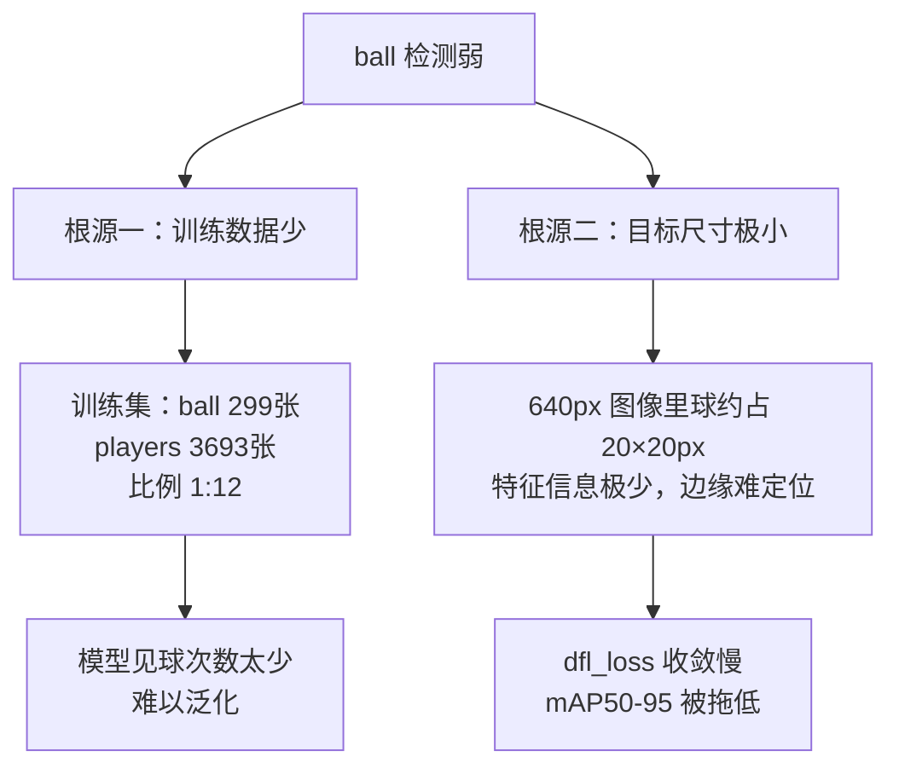
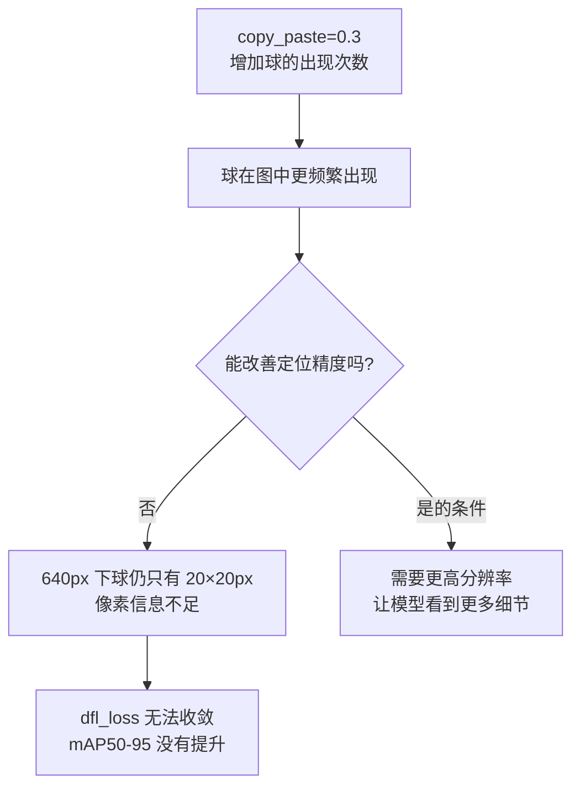
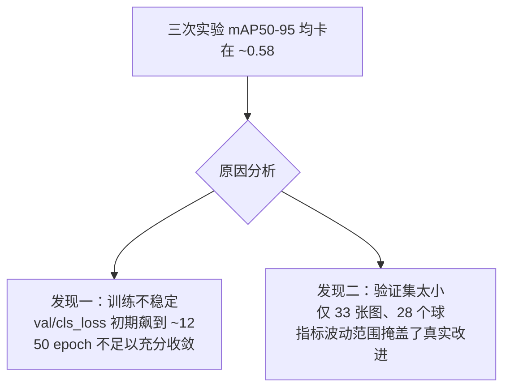

# exp1 诊断 → exp2 改进计划

上级笔记：[[YOLO学习路线图]]
相关笔记：[[损失函数 YOLO Loss]] · [[YOLOv11-目标检测入门]]

---

## exp1 结果回顾

| 类别 | mAP50 | mAP50-95 |
|------|-------|----------|
| players | 0.993 | 0.656 |
| referee | 0.971 | 0.688 |
| **ball** | **0.892** | **0.411** ← 最弱 |

**结论**：模型能找到球（mAP50 尚可），但框得不准（mAP50-95 偏低）。ball 是唯一需要改进的类别。

---

## 根本原因



> [!NOTE] 从 labels.jpg 直接读出
> 训练集类别分布图（左上柱状图）和宽高分布（右下散点图）直接说明了这两个问题：ball 柱最矮，ball 点云在左下角（极小尺寸）。

---

## exp2 改进方向

### 方向一：增加球的数据量

从 Roboflow 补充含球标注的足球数据集，合并到现有训练集。

目标：ball 实例从 299 → 600+

### 方向二：提高输入分辨率

```
exp1: imgsz=640  → 球约 20×20 px
exp2: imgsz=1280 → 球约 40×40 px（特征量 ×4）
```

分辨率翻倍让模型看到更多球的细节，直接改善 dfl_loss 的收敛。

### 方向三：copy_paste 数据增强（辅助）

YOLO 内置增强，把球的标注框随机复制粘贴到其他图片，人为提高球的出现频率。

```bash
copy_paste=0.3
```

---

## exp2 训练配置（进行中）

一次只改一个变量，方便对比效果：

```bash
yolo train \
  model=yolo11s.pt \
  data=.../data.yaml \
  epochs=50 \
  imgsz=640 \
  batch=16 \
  copy_paste=0.3 \
  project=.../runs \
  name=exp2
```

> [!NOTE] 为什么 imgsz 暂时保持 640
> CPU 下 1280px 训练约需 10h。exp2 先单独验证 copy_paste 的效果，再决定是否升分辨率。

## exp3 计划（exp2 完成后）

在 exp2 基础上加入分辨率提升，使用 Apple M5 的 MPS GPU 加速（`device=mps`）：

```bash
yolo train \
  model=yolo11s.pt \
  data=.../data.yaml \
  epochs=50 \
  imgsz=1280 \
  batch=8 \
  copy_paste=0.3 \
  device=mps \
  project=.../runs \
  name=exp3
```

> [!WARNING] batch 从 16 降到 8
> 分辨率翻倍后内存占用约为原来的 4 倍，需要降低 batch size。

---

## exp2 实际结果（2026-05-31）

> 实际运行目录：`runs/exp2-2`（exp2 目录已被中断的测试占用，YOLO 自动新建）

| 指标 | exp1 | exp2 | 变化 |
|------|------|------|------|
| Precision | 0.947 | 0.930 | ↓ 略降 |
| Recall | 0.927 | 0.945 | ↑ 略升 |
| mAP50 | 0.952 | 0.956 | → 持平 |
| mAP50-95 | 0.585 | 0.580 | → **几乎无变化** |
| box_loss | 1.013 | 1.013 | → 完全相同 |
| cls_loss | 0.471 | 0.471 | → 完全相同 |
| dfl_loss | 1.000 | 1.000 | → 完全相同 |

混淆矩阵与 exp1 几乎一致，copy_paste 未产生明显改善。

### 结论：copy_paste 无效，瓶颈是分辨率



> [!IMPORTANT] 关键学到的东西
> 数据增强能解决"样本少"的问题，但无法解决"分辨率不足"的问题。当目标本身太小时，提高输入分辨率才是正确方向。

---

## exp3 计划（下一步）

**假设**：imgsz=1280 让球从 20px 变成 40px，dfl_loss 将获得足够信息收敛，mAP50-95 应有明显提升。

```bash
yolo train \
  model=yolo11s.pt \
  data=.../data.yaml \
  epochs=50 \
  imgsz=1280 \
  batch=8 \
  copy_paste=0.3 \
  device=mps \
  project=.../runs \
  name=exp3
```

| 参数 | 变化 | 原因 |
|------|------|------|
| imgsz | 640 → 1280 | 球从 20px 变 40px，特征量 ×4 |
| batch | 16 → 8 | 分辨率翻倍，内存占用 ×4 |
| device | cpu → mps | Apple M5 GPU 加速，抵消时间增加 |
| copy_paste | 0.3 | 保留，配合高分辨率效果更好 |

## exp3 实际结果（2026-05-31）

| 指标 | exp1 | exp2 | exp3 | 变化 |
|------|------|------|------|------|
| Precision | 0.947 | 0.930 | 0.916 | ↓ |
| Recall | 0.927 | 0.945 | 0.917 | → |
| mAP50 | 0.952 | 0.956 | 0.959 | → |
| **mAP50-95** | **0.585** | **0.580** | **0.580** | **→ 三次均卡在 ~0.58** |
| box_loss | 1.013 | 1.013 | 0.968 | ↓ 有改善 |
| cls_loss | 0.471 | 0.471 | 0.423 | ↓ 有改善 |
| dfl_loss | 1.000 | 1.000 | 1.029 | ↑ 略变差 |

### 混淆矩阵变化

| 背景误判为 | exp1 | exp3 |
|-----------|------|------|
| players | 0.70 | **0.82** ↑ 变差 |
| ball | 0.17 | **0.14** ↓ 略改善 |

高分辨率下模型看到更多球员局部特征，背景→players 误报率反而上升。

### 两个关键发现



> [!IMPORTANT] 核心结论
> 瓶颈不是分辨率，也不是增强——是**验证集数据量太少**，无法准确衡量改进效果。box_loss 和 cls_loss 在 exp3 中确实下降了，说明模型学得更好，但 mAP 数字反映不出来。

### 下一步：路线 B —— 补充数据

三次实验共同指向同一个方向：从 Roboflow 补充含球标注的足球数据集，将验证集球的实例从 28 个增加到 80+ 个，才能真实衡量后续改进效果。
