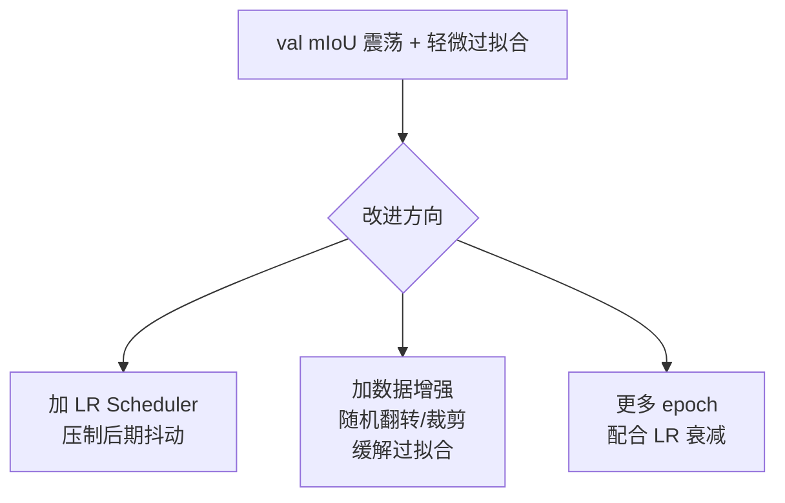

# 语义分割 exp1 计划

上级笔记：[[SegFormer-语义分割入门]]
路线图：[[CV学习总路线图]]

---

## 目标

**学习目标**（比跑出好结果更重要）：
1. 自己写 PyTorch Dataset 类处理 VOC2012 分割标注
2. 跑通完整训练循环（forward / loss / backward / optimizer）
3. 实现 mIoU 计算并在 val 集上评估
4. 对比"微调预训练权重"和"从头训练"的速度差异

---

## 数据集：PASCAL VOC 2012

**获取方式**（torchvision 自动下载，约 2GB）：

```bash
# 在项目目录里运行一次，下载到 ./data/VOCdevkit/
python -c "
import torchvision.datasets as d
d.VOCSegmentation('./data', year='2012', image_set='train', download=True)
"
```

**数据结构**：
```
data/VOCdevkit/VOC2012/
├── JPEGImages/          # 原始图像 .jpg
├── SegmentationClass/   # 语义分割 mask .png（像素值 = 类别id）
├── ImageSets/
│   └── Segmentation/
│       ├── train.txt    # 1464 张训练图的文件名列表
│       └── val.txt      # 1449 张验证图的文件名列表
└── Annotations/         # 目标检测 bbox 标注（分割任务不用）
```

**类别 id 规则**：
- 0 = 背景
- 1–20 = 20 个物体类
- 255 = 边界/忽略区域（loss 中 `ignore_index=255`）

---

## 项目结构（计划）

```
projects/segformer-voc/
├── configs/
│   └── config.yaml          # 超参数
├── src/
│   ├── dataset.py           # VOC2012Dataset 类
│   ├── model.py             # 加载 SegFormer
│   ├── train.py             # 训练循环
│   ├── evaluate.py          # mIoU 计算
│   └── utils.py             # 可视化
├── data/                    # VOCdevkit 放这里（或软链接）
├── runs/
│   └── exp1/
└── train.py                 # 入口脚本
```

---

## exp1 配置

| 参数 | 值 | 原因 |
|------|-----|------|
| model | `nvidia/mit-b0` | 最小最快，适合入门 |
| 权重 | 预训练（ImageNet）| 微调比从头训练快得多 |
| imgsz | 512×512 | SegFormer 默认分辨率 |
| batch | 8 | Colab T4 显存够用 |
| epochs | 20 | 微调不需要太多 epoch |
| lr | 6e-5 | HuggingFace 推荐的微调 lr |
| optimizer | AdamW | Transformer 标配 |
| loss | CrossEntropyLoss(ignore_index=255) | |
| device | cuda（Colab T4）| 本地 MPS 有反向传播 bug，改用 Colab |

---

## 核心代码：VOC2012Dataset

```python
import torch
from torch.utils.data import Dataset
from PIL import Image
import numpy as np
import os

class VOC2012Dataset(Dataset):
    def __init__(self, root, split="train", transform=None, target_transform=None):
        self.root = root
        self.transform = transform
        self.target_transform = target_transform
        
        # 读取文件名列表
        split_file = os.path.join(root, "VOCdevkit/VOC2012/ImageSets/Segmentation", f"{split}.txt")
        with open(split_file) as f:
            self.ids = [line.strip() for line in f]
        
        self.img_dir = os.path.join(root, "VOCdevkit/VOC2012/JPEGImages")
        self.mask_dir = os.path.join(root, "VOCdevkit/VOC2012/SegmentationClass")
    
    def __len__(self):
        return len(self.ids)
    
    def __getitem__(self, idx):
        name = self.ids[idx]
        img = Image.open(os.path.join(self.img_dir, f"{name}.jpg")).convert("RGB")
        mask = Image.open(os.path.join(self.mask_dir, f"{name}.png"))  # 调色板模式
        
        if self.transform:
            img = self.transform(img)
        if self.target_transform:
            mask = self.target_transform(mask)
        
        # mask 转为 long tensor（类别 id）
        mask = torch.as_tensor(np.array(mask), dtype=torch.long)
        return img, mask
```

> [!WARNING] mask 不能直接用 ToTensor()
> `ToTensor()` 会把值归一化到 [0,1]，破坏类别 id 的整数语义。
> 必须用 `np.array(mask)` → `torch.long`。

---

## mIoU 计算

```python
def compute_miou(preds, targets, num_classes=21, ignore_index=255):
    """
    preds:   (H, W) 预测类别 id
    targets: (H, W) 真实类别 id
    """
    iou_list = []
    for cls in range(num_classes):
        pred_mask = (preds == cls)
        true_mask = (targets == cls)
        valid = (targets != ignore_index)
        
        intersection = (pred_mask & true_mask & valid).sum().item()
        union = ((pred_mask | true_mask) & valid).sum().item()
        
        if union == 0:
            continue  # 这个类在当前图中不存在，跳过
        iou_list.append(intersection / union)
    
    return sum(iou_list) / len(iou_list) if iou_list else 0.0
```

---

## 预期结果

| 场景 | 预期 mIoU |
|------|-----------|
| SegFormer-B0 微调 20 epoch | ~60-65% |
| SegFormer-B0 从头训练 | <<50%（需要更多 epoch）|
| SOTA（SegFormer-B5）| ~83% |

> [!NOTE] 参考基线
> YOLO 足球项目的 mAP50=0.952 听起来很高，但任务更简单（3类+bbox）。
> 语义分割 21 类的 mIoU=0.65 才是合理的"入门成绩"。

---

## 实验日志

| 实验 | 配置 | 最佳 mIoU | epoch |
|------|------|----------|-------|
| exp1 | B0 微调，512px，20ep，lr=6e-5，Colab T4 | **0.6658** | 19 |

---

## exp1 完整训练曲线（2026-06-01）

| Epoch | train loss | val mIoU |
|-------|-----------|---------|
| 01 | 1.9309 | 0.2912 |
| 02 | 1.0620 | 0.4552 |
| 03 | 0.7298 | 0.5375 |
| 04 | 0.5417 | 0.5806 |
| 05 | 0.4316 | 0.6123 |
| 06 | 0.3533 | 0.6188 |
| 07 | 0.2972 | 0.6121 |
| 08 | 0.2672 | 0.6323 |
| 09 | 0.2299 | 0.6445 |
| 10 | 0.1990 | 0.6245 |
| 11 | 0.1813 | 0.6418 |
| 12 | 0.1609 | 0.6346 |
| 13 | 0.1446 | 0.6622 |
| 14 | 0.1532 | 0.6473 |
| 15 | 0.1385 | 0.6514 |
| 16 | 0.1260 | 0.6599 |
| 17 | 0.1288 | 0.6562 |
| 18 | 0.1161 | 0.6529 |
| 19 | 0.1002 | **0.6658** ← 最佳 |
| 20 | 0.0975 | 0.6586 |

---

## 结果分析

### 现象一：前 5 epoch 快速收敛

mIoU 从 0.29 → 0.61，loss 从 1.93 → 0.43，提升最快。
原因：编码器权重已经够好，解码头从随机初始化出发，一开始梯度大、更新快。

### 现象二：5 epoch 后震荡而非单调上升

mIoU 在 0.62–0.67 之间来回抖动，没有持续上升。
原因：固定学习率（lr=6e-5）对收敛后期来说偏大，模型在最优点附近反复跳动。

> [!TIP] 改进方向
> 加入学习率衰减（CosineAnnealingLR 或 PolynomialLR）可以压制后期抖动，让 mIoU 继续提升。

### 现象三：轻微过拟合信号

Epoch 20 的 train loss（0.0975）比 epoch 19（0.1002）更低，但 val mIoU 反而下降（0.6586 < 0.6658）。训练集继续进步，验证集开始走平——过拟合的早期信号。



### 成绩定位

| 对比 | mIoU |
|------|------|
| 预期区间（入门成绩）| 60–65% |
| **exp1 实际最佳** | **66.58%** |
| SegFormer-B5 SOTA | ~83% |

超出预期上限，配置简单（无 LR 衰减、无额外增强）的情况下达到 66.58%，说明 ImageNet 预训练权重迁移效果好。

---

## 检查清单

- [x] 下载 VOC2012 数据集，验证文件结构（1464 train / 1449 val）
- [x] 写 `VOC2012Dataset`，检查第一个样本的 image shape 和 mask 唯一值
      → image: (3,512,512) float32，mask: (512,512) int64，类别 id 正确
- [x] 可视化一张图 + mask（直接读 JPEGImages + SegmentationClass 目录查看）
- [x] 加载 SegFormer-B0 预训练权重，理解 UNEXPECTED/MISSING 报告
      → 见 [[迁移学习与微调]]
- [x] 跑通 forward pass 和 loss 计算
- [x] 实现 mIoU 并在 val 集上评估
- [x] 完成 20 epoch 训练，最佳 val mIoU = 0.6658（epoch 19）
- [ ] 可视化预测结果（predictions.png）← 进行中
