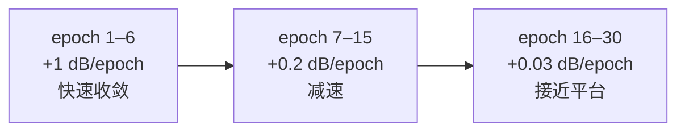

# SRCNN exp1 结果

上级笔记：[[SRCNN-超分辨率入门]]
路线图：[[CV学习总路线图]]

---

## 配置

| 参数 | 值 | 说明 |
|------|-----|------|
| model | SRCNN（3层 CNN）| 自己实现，20,099 参数 |
| 数据集 | VOC2012 JPEGImages | 复用已有数据，动态生成 LR/HR 对 |
| scale | 2x | LR 是 HR 的一半分辨率 |
| patch_size | 128×128 | 随机裁剪的训练块大小 |
| train/val split | 1300 / 164 张 | 按文件名排序切分 |
| epochs | 30 | |
| batch_size | 16 | |
| lr | 1e-4 | Adam 优化器 |
| loss | MSELoss | 像素级均方误差 |
| device | mps | Apple M5，CNN 无 MPS bug |

---

## 完整训练曲线

| Epoch | loss | val PSNR |
|-------|------|---------|
| 01 | 0.055592 | 18.10 dB |
| 02 | 0.012749 | 20.38 dB |
| 03 | 0.008231 | 21.63 dB |
| 05 | 0.005916 | 22.97 dB |
| 10 | 0.004089 | 24.66 dB |
| 13 | 0.003617 | 25.10 dB ← 过 25 dB 门槛 |
| 20 | 0.003122 | 25.88 dB |
| 25 | 0.002975 | 26.16 dB |
| 30 | 0.002909 | **26.32 dB** |

---

## 结果分析

### 收敛阶段

### 各图 PSNR 对比（val 样本）

| 场景 | Bicubic | SRCNN | 提升 |
|------|---------|-------|------|
| 字母文字（Nike）| 27.03 | 27.92 | **+0.89 dB** |
| 毛绒纹理 | 24.85 | 24.97 | +0.12 dB |
| 室内场景 | 27.87 | 27.99 | +0.12 dB |
| 船体细节 | 18.19 | 18.60 | +0.41 dB |

### 关键发现

**SRCNN 稳定超过 Bicubic 基线**，证明模型确实学到了图像高频信息的恢复规律。

提升幅度与场景类型强相关：
- 高对比边缘（文字）：提升最大（+0.89 dB），视觉效果明显
- 平滑区域、随机噪声：提升极小（+0.12 dB），人眼几乎看不出差别
- 细节已丢失的场景（船体小字）：两者都远离 Ground Truth，超分无法还原已消失的信息

> [!IMPORTANT] 核心局限
> MSE loss 优化的是平均像素误差，倾向于输出"模糊但安全"的结果。
> 这就是为什么即使 PSNR 提升，主观看还是觉得不够锐利——ESRGAN 用感知损失解决了这个问题。

---

## 与 SegFormer exp1 横向对比

|         | SRCNN         | SegFormer-B0        |
| ------- | ------------- | ------------------- |
| 参数量     | 20K           | 3.7M                |
| 训练设备    | 本地 MPS ✅      | Colab T4（MPS 有 bug） |
| 训练时间    | 几分钟           | ~30 分钟              |
| 最终指标    | PSNR 26.32 dB | mIoU 0.6658         |
| Loss 类型 | MSE（回归）       | CrossEntropy（分类）    |
