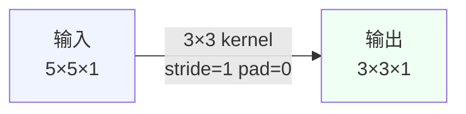
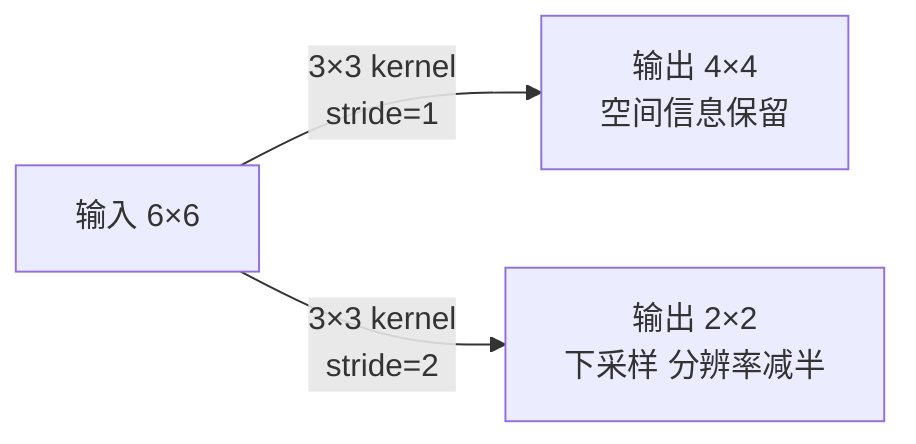
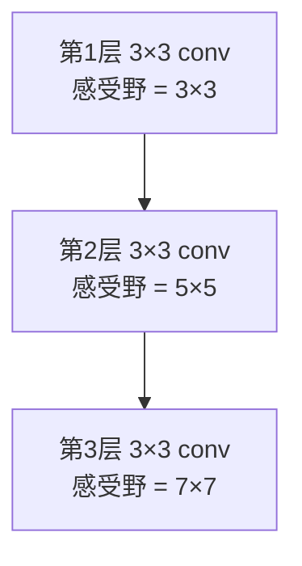
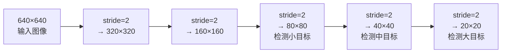
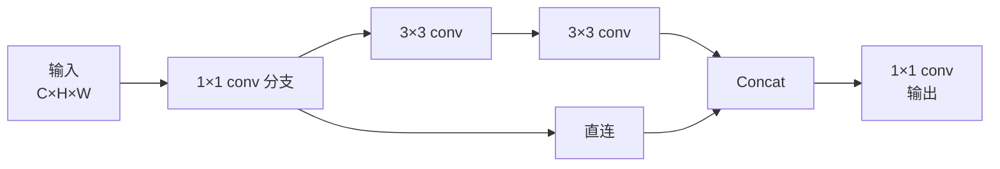

# 卷积神经网络基础

> **一句话**：卷积层用一个小窗口（kernel）在图像上滑动，提取局部特征，越深的层感受野越大、语义越抽象。

上级笔记：[[YOLO学习路线图]]

---

## 一、卷积操作是什么？

### 直觉理解

把一个 3×3 的"滤镜"贴在图像上，计算覆盖区域的加权和，然后滑动到下一个位置，得到一张新的特征图（Feature Map）。

### 数学定义

对于输入 $X$（H×W×C）和 kernel $W$（k×k×C），输出特征图第 $(i,j)$ 位置的值：

$$y_{i,j} = \sum_{c=1}^{C} \sum_{m=0}^{k-1} \sum_{n=0}^{k-1} W_{m,n,c} \cdot X_{i \cdot s + m,\ j \cdot s + n,\ c} + b$$

其中 $s$ 是 stride（步长）。

---

## 二、三个关键参数

### 1. Kernel Size（卷积核大小）

| Kernel | 特点 | 常见用途 |
|--------|------|---------|
| 1×1 | 跨通道线性变换，不感知空间 | 降维、升维（如 YOLO 的 bottleneck） |
| 3×3 | 最常用，感知局部空间关系 | 绝大多数特征提取层 |
| 7×7 | 感受野大，计算贵 | 网络第一层（如 ResNet stem） |

> [!TIP] 为什么 3×3 最流行？
> 两个 3×3 卷积堆叠的感受野等于一个 5×5，但参数量只有 $2 \times 9 = 18$，而 5×5 需要 25 个参数，且中间多一层非线性，表达能力更强。

### 2. Stride（步长）

步长控制 kernel 每次滑动的距离，直接影响输出特征图的尺寸：

$$H_{out} = \left\lfloor \frac{H_{in} - k + 2p}{s} \right\rfloor + 1$$

在 YOLO 中，stride=2 的卷积用于**下采样**（替代 MaxPool），逐步将 640×640 压缩到 20×20、10×10 等多尺度特征图。

### 3. Padding（填充）

在输入边缘补零，使输出尺寸可控：

| Padding 类型 | 效果 |
|-------------|------|
| `padding=0`（valid）| 输出比输入小 |
| `padding=k//2`（same）| 输出与输入同尺寸 |

---

## 三、感受野（Receptive Field）

### 定义

输出特征图上某个位置的值，是由输入图像哪个区域决定的——这个区域就是该位置的**感受野**。

### 感受野随深度增长

每多一层 3×3 卷积，感受野增加 2（理论值）。实际有效感受野通常比理论值小，但深层仍能"看"到更大区域。

### 为什么感受野影响 Anchor 分配？

在 [[Anchor Box 机制]] 中：
- **小感受野（浅层/大特征图）** → 只能感知局部细节 → 分配**小 Anchor** 检测小目标（如足球）
- **大感受野（深层/小特征图）** → 能感知全局语义 → 分配**大 Anchor** 检测大目标（如球员）

---

## 四、批归一化（Batch Normalization）

几乎所有现代 CNN（包括 YOLO11）都在卷积后接 BN，作用：

1. **加速训练**：将每层输出归一化，让梯度更稳定
2. **减少对学习率的敏感性**
3. **轻微正则化效果**

$$\hat{x} = \frac{x - \mu_B}{\sqrt{\sigma_B^2 + \epsilon}}, \quad y = \gamma \hat{x} + \beta$$

YOLO 中的标准模块：`Conv → BN → SiLU`（SiLU 即 $x \cdot \sigma(x)$，比 ReLU 在负值区域更平滑）。

---

## 五、YOLO 中的典型卷积模块

### C3k2（YOLO11 核心模块）

这是 CSP（Cross Stage Partial）思想：一部分特征走残差路径，另一部分直连，**减少计算量同时保留梯度流**。

---

## 关联笔记

- [[YOLO学习路线图]] — 回到总览
- [[Anchor Box 机制]] — 感受野如何决定 Anchor 分配
- [[损失函数 YOLO Loss]] — 卷积输出如何参与 Loss 计算
- [[多尺度特征金字塔 FPN]] — 多尺度特征提取原理

---

*下一步*：[[损失函数 YOLO Loss]]
