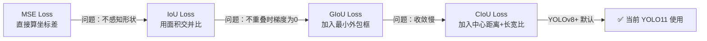
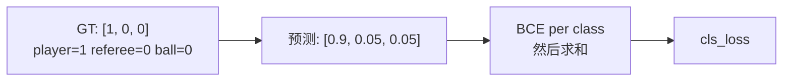
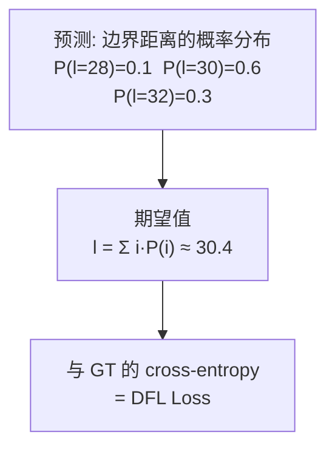
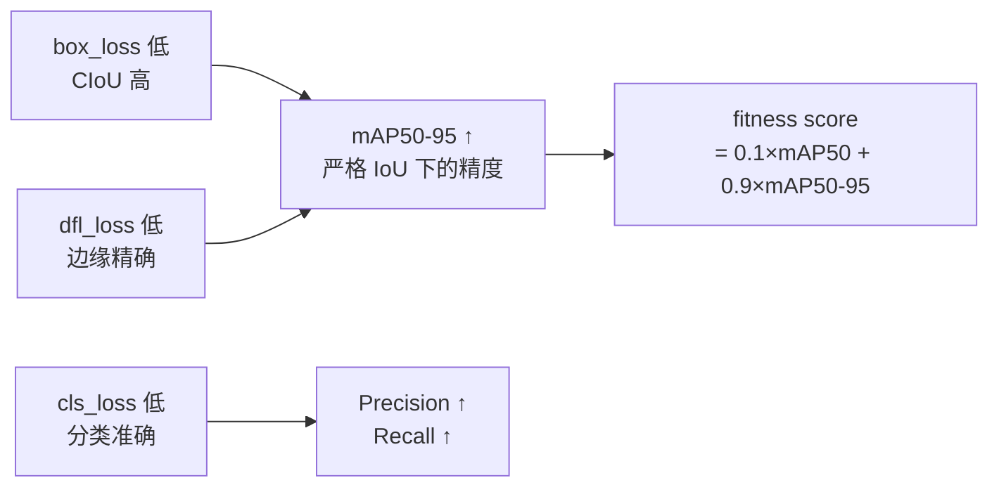

# 损失函数 YOLO Loss

> **一句话**：YOLO 的总 Loss 由三部分组成——**定位损失**（框在哪）、**分类损失**（是什么）、**分布焦点损失**（框的边缘精度）——对应训练日志里的 `box_loss`、`cls_loss`、`dfl_loss`。

上级笔记：[[YOLO学习路线图]]

---

## 对应训练日志的三列

你在 `exp1` 训练日志里看到的每一行：

```
Epoch  box_loss  cls_loss  dfl_loss
 1/50    1.797     1.807     1.329
50/50    1.013     0.471     1.000
```

这三列就是下面三个损失分量。整体趋势：**box 和 cls 下降最明显，dfl 相对稳定**，这是正常现象。

---

## 一、Box Loss（定位损失）——框在哪里

### 从 L2 到 IoU 的演进

早期 YOLO 用均方误差（MSE）直接回归坐标，问题是两个框的 MSE 相同，IoU 可能差很多。现代 YOLO 改用基于 **IoU** 的损失。



### CIoU 公式

$$\mathcal{L}_{box} = 1 - \text{IoU} + \frac{\rho^2(b, b^{gt})}{c^2} + \alpha v$$

| 项 | 含义 |
|----|------|
| $1 - \text{IoU}$ | 基础重叠度惩罚 |
| $\frac{\rho^2}{c^2}$ | 预测框与 GT 框中心点的归一化距离 |
| $\alpha v$ | 长宽比一致性惩罚（$v = \frac{4}{\pi^2}(\arctan\frac{w^{gt}}{h^{gt}} - \arctan\frac{w}{h})^2$） |

> [!TIP] 直觉理解 CIoU
> 不只要求"面积重叠大"，还要求"中心点近"且"长宽比相似"——这正是球检测困难的原因：球是正圆形，但预测框经常稍微偏长或偏宽，长宽比惩罚项会拉高 loss。

---

## 二、Cls Loss（分类损失）——框里是什么

### 二值交叉熵（BCE）

YOLO 对每个类别独立做二分类（而不是 Softmax），使用 **Binary Cross Entropy**：

$$\mathcal{L}_{cls} = -\sum_{c} \left[ y_c \log(\hat{p}_c) + (1 - y_c) \log(1 - \hat{p}_c) \right]$$



> [!NOTE] 为什么不用 Softmax？
> Softmax 假设类别互斥（一个框只能是一类）。BCE 允许多标签——对足球场景意义不大，但对通用检测任务更灵活。

### cls_loss 在 exp1 中下降最快（1.807 → 0.471）

因为 3 个类别（player / referee / ball）视觉差异明显，模型很快学会区分。相比之下，box_loss 收敛慢，是因为精确定位比分类更难。

---

## 三、DFL Loss（分布焦点损失）——框边缘在哪里

DFL 是 YOLOv8 引入的新损失，专门为 **Anchor-free** 检测设计。

### 背景：为什么需要 DFL？

传统方法直接回归一个确定的边界值（如距离左边 `l = 30px`）。但现实中边界往往是模糊的（如球员的脚踩在草地上），用**概率分布**来表示更合理。



### DFL 公式

将连续距离离散化为 $n$ 个 bin，网络预测每个 bin 的概率 $p_i$，真实距离 $y$ 分配到相邻两个 bin $\lfloor y \rfloor$ 和 $\lceil y \rceil$：

$$\mathcal{L}_{DFL} = -\left[ (y_{i+1} - y) \log p_i + (y - y_i) \log p_{i+1} \right]$$

> [!INFO] DFL 在 exp1 中下降最小（1.329 → 1.000）
> DFL 衡量边缘定位精度，这是最难收敛的部分，尤其对于小目标（球）和遮挡目标（球员重叠）。ball 的 mAP50-95 只有 0.411，主要瓶颈就在这里。

---

## 四、总 Loss

$$\mathcal{L}_{total} = \lambda_{box} \cdot \mathcal{L}_{box} + \lambda_{cls} \cdot \mathcal{L}_{cls} + \lambda_{dfl} \cdot \mathcal{L}_{dfl}$$

YOLO11 默认权重：$\lambda_{box}=7.5,\ \lambda_{cls}=0.5,\ \lambda_{dfl}=1.5$。

> [!WARNING] 注意权重的含义
> `box_loss` 系数最大（7.5），说明定位精度比分类更重要。这也是为什么 `box_loss` 在日志里虽然绝对值比 `cls_loss` 大，但下降幅度更直接影响 mAP50-95。

---

## 五、Loss 与评估指标的关系



exp1 结果回顾：
- `cls_loss` 降幅最大 → Precision=0.947, Recall=0.927 表现好
- `dfl_loss` 降幅最小 → ball 的 mAP50-95=0.411 偏低，边缘定位是瓶颈

---

## 关联笔记

- [[YOLO学习路线图]] — 回到总览
- [[Anchor Box 机制]] — Anchor-free 如何改变 box loss 的计算方式
- [[卷积神经网络基础]] — 网络输出特征图如何产生预测值
- [[超参数调整指南]] — 如何通过调整 loss 权重改善 ball 检测

---

*下一步*：[[超参数调整指南]] 或查看 `_03_Tuning_Logs/` 记录 exp1 调参思路
